# 📐 BƯỚC 1: THIẾT KẾ CƠ SỞ DỮ LIỆU — DigiBook (Oracle 19c)

> **Chủ đề:** Thiết kế CSDL cho website bán sách DigiBook  
> **Nhóm 4:** Dũng, Nam, Hiếu, Phát  
> **DBMS:** Oracle 19c  
> **Chuẩn hóa:** 3NF (Third Normal Form)  

---

## 📋 MỤC LỤC

1. [Tổng quan hệ thống](#1-tổng-quan-hệ-thống)
2. [Xác định các thực thể](#2-xác-định-các-thực-thể)
3. [Chi tiết thuộc tính, PK, FK và ràng buộc](#3-chi-tiết-thuộc-tính-pk-fk-và-ràng-buộc)
4. [Giải trình thiết kế (Design Rationale)](#4-giải-trình-thiết-kế-design-rationale)
5. [Chuẩn hóa 3NF](#5-chuẩn-hóa-3nf)
6. [Phân công công việc](#6-phân-công-công-việc)
7. [ERD — Entity Relationship Diagram (Mermaid)](#7-erd--entity-relationship-diagram-mermaid)
8. [Tóm tắt thiết kế](#8-tóm-tắt-thiết-kế)

---

## 1. Tổng quan hệ thống

**DigiBook** là nền tảng thương mại điện tử chuyên bán sách trực tuyến. Hệ thống hỗ trợ các chức năng chính sau:

| STT | Chức năng | Mô tả |
|-----|-----------|-------|
| 1 | Quản lý sách | Thêm, sửa, xóa, mô tả, đa ảnh, liên kết tác giả |
| 2 | Quản lý danh mục | Phân loại sách, hỗ trợ danh mục nhiều cấp |
| 3 | Quản lý khách hàng | Đăng ký, đăng nhập, cập nhật thông tin |
| 4 | Giỏ hàng | Lưu sách trước khi đặt hàng |
| 5 | Đặt hàng & thanh toán | Tạo đơn, thanh toán, theo dõi trạng thái |
| 6 | Lịch sử trạng thái | Audit trạng thái đơn theo thời gian |
| 7 | Quản lý kho | Theo dõi giao dịch nhập/xuất/điều chỉnh |
| 8 | Đánh giá sách | Chỉ người đã mua mới được đánh giá |
| 9 | Quản lý tác giả | Hồ sơ tác giả, vai trò (tác giả, dịch giả) |
| 10 | Quản lý NXB | Liên kết nhà xuất bản với sách |

---

## 2. Xác định các thực thể

Hệ thống DigiBook bao gồm **15 thực thể**:

| STT | Thực thể (Entity) | Ý nghĩa | Phụ trách |
|-----|--------------------|----------|-----------|
| 1 | `CUSTOMERS` | Khách hàng | **Dũng** |
| 2 | `CATEGORIES` | Danh mục sách | **Dũng** |
| 3 | `CARTS` | Giỏ hàng | **Dũng** |
| 4 | `CART_ITEMS` | Dòng sản phẩm trong giỏ | **Dũng** |
| 5 | `AUTHORS` | Tác giả | **Nam** |
| 6 | `PUBLISHERS` | Nhà xuất bản | **Nam** |
| 7 | `BOOKS` | Thông tin sách | **Hiếu** |
| 8 | `BOOK_IMAGES` | Ảnh sách | **Hiếu** |
| 9 | `BOOK_AUTHORS` | Liên kết sách – tác giả | **Hiếu** |
| 10 | `INVENTORY_TRANSACTIONS` | Giao dịch kho | **Hiếu** |
| 11 | `ORDERS` | Đơn hàng | **Phát** |
| 12 | `ORDER_DETAILS` | Chi tiết đơn hàng | **Phát** |
| 13 | `ORDER_STATUS_HISTORY` | Lịch sử trạng thái đơn | **Phát** |
| 14 | `REVIEWS` | Đánh giá sách | **Phát** |
| 15 | `COUPONS` | Mã giảm giá/Voucher | **Nam** |

---

## 3. Chi tiết thuộc tính, PK, FK và ràng buộc

### 3.1. Bảng `CUSTOMERS` — Khách hàng *(Phụ trách: Dũng)*

| Thuộc tính | Kiểu dữ liệu | Ràng buộc | Mô tả |
|------------|---------------|-----------|-------|
| `customer_id` | `NUMBER` | **PK**, Auto-increment (Sequence + Trigger) | Mã khách hàng |
| `full_name` | `NVARCHAR2(100)` | `NOT NULL` | Họ và tên |
| `email` | `VARCHAR2(150)` | `NOT NULL`, `UNIQUE` | Email đăng nhập |
| `password_hash` | `VARCHAR2(256)` | `NOT NULL` | Mật khẩu đã mã hóa |
| `phone` | `VARCHAR2(15)` | `UNIQUE` | Số điện thoại |
| `address` | `NVARCHAR2(500)` | — | Địa chỉ giao hàng mặc định (beta) |
| `created_at` | `DATE` | `DEFAULT SYSDATE` | Ngày tạo tài khoản |
| `updated_at` | `DATE` | — | Ngày cập nhật |
| `status` | `VARCHAR2(20)` | `DEFAULT 'ACTIVE'`, `CHECK (status IN ('ACTIVE', 'INACTIVE', 'BANNED'))` | Trạng thái tài khoản |

> **Gợi ý:** Có thể tạo unique index theo `LOWER(email)` để tránh trùng email khác hoa thường.
>
> **Mở rộng khi scale:** Tách bảng `CUSTOMER_ADDRESSES` (1:N) để hỗ trợ nhiều địa chỉ nhận hàng.

### 3.2. Bảng `CATEGORIES` — Danh mục sách *(Phụ trách: Dũng)*

| Thuộc tính | Kiểu dữ liệu | Ràng buộc | Mô tả |
|------------|---------------|-----------|-------|
| `category_id` | `NUMBER` | **PK**, Auto-increment | Mã danh mục |
| `category_name` | `NVARCHAR2(100)` | `NOT NULL`, `UNIQUE` | Tên danh mục |
| `description` | `NVARCHAR2(500)` | — | Mô tả danh mục |
| `parent_id` | `NUMBER` | **FK** → `CATEGORIES(category_id)` | Danh mục cha (nullable) |

### 3.3. Bảng `CARTS` — Giỏ hàng *(Phụ trách: Dũng)*

| Thuộc tính | Kiểu dữ liệu | Ràng buộc | Mô tả |
|------------|---------------|-----------|-------|
| `cart_id` | `NUMBER` | **PK**, Auto-increment | Mã giỏ hàng |
| `customer_id` | `NUMBER` | **FK** → `CUSTOMERS(customer_id)`, `NOT NULL` | Chủ giỏ hàng |
| `created_at` | `DATE` | `DEFAULT SYSDATE` | Ngày tạo |
| `updated_at` | `DATE` | — | Ngày cập nhật |
| `status` | `VARCHAR2(20)` | `DEFAULT 'ACTIVE'`, `CHECK (status IN ('ACTIVE','MERGED','ABANDONED'))` | Trạng thái |

### 3.4. Bảng `CART_ITEMS` — Dòng sản phẩm trong giỏ *(Phụ trách: Dũng)*

| Thuộc tính | Kiểu dữ liệu | Ràng buộc | Mô tả |
|------------|---------------|-----------|-------|
| `cart_item_id` | `NUMBER` | **PK**, Auto-increment | Mã dòng |
| `cart_id` | `NUMBER` | **FK** → `CARTS(cart_id)`, `NOT NULL` | Mã giỏ |
| `book_id` | `NUMBER` | **FK** → `BOOKS(book_id)`, `NOT NULL` | Mã sách |
| `quantity` | `NUMBER` | `NOT NULL`, `CHECK (quantity > 0)` | Số lượng |
| `unit_price` | `NUMBER(10,2)` | `NOT NULL`, `CHECK (unit_price > 0)` | Giá tại thời điểm thêm |
| `created_at` | `DATE` | `DEFAULT SYSDATE` | Ngày thêm |
| `updated_at` | `DATE` | — | Ngày cập nhật |

> **Gợi ý:** Thêm `UNIQUE(cart_id, book_id)` để tránh trùng dòng cùng một sách.

### 3.5. Bảng `AUTHORS` — Tác giả *(Phụ trách: Nam)*

| Thuộc tính | Kiểu dữ liệu | Ràng buộc | Mô tả |
|------------|---------------|-----------|-------|
| `author_id` | `NUMBER` | **PK**, Auto-increment | Mã tác giả |
| `author_name` | `NVARCHAR2(150)` | `NOT NULL` | Tên tác giả |
| `biography` | `NCLOB` | — | Tiểu sử tác giả |
| `birth_date` | `DATE` | — | Ngày sinh |
| `nationality` | `NVARCHAR2(50)` | — | Quốc tịch |

### 3.6. Bảng `PUBLISHERS` — Nhà xuất bản *(Phụ trách: Nam)*

| Thuộc tính | Kiểu dữ liệu | Ràng buộc | Mô tả |
|------------|---------------|-----------|-------|
| `publisher_id` | `NUMBER` | **PK**, Auto-increment | Mã NXB |
| `publisher_name` | `NVARCHAR2(200)` | `NOT NULL`, `UNIQUE` | Tên NXB |
| `address` | `NVARCHAR2(500)` | — | Địa chỉ NXB |
| `phone` | `VARCHAR2(15)` | — | Số điện thoại |
| `email` | `VARCHAR2(150)` | `UNIQUE` | Email liên hệ |

### 3.6.1. Bảng `COUPONS` — Mã giảm giá/Voucher *(Phụ trách: Nam)*

| Thuộc tính | Kiểu dữ liệu | Ràng buộc | Mô tả |
|------------|---------------|-----------|-------|
| `coupon_id` | `NUMBER` | **PK**, Auto-increment | Mã coupon |
| `coupon_code` | `VARCHAR2(50)` | `NOT NULL`, `UNIQUE` | Mã voucher |
| `coupon_name` | `NVARCHAR2(150)` | `NOT NULL` | Tên chương trình |
| `discount_type` | `VARCHAR2(10)` | `NOT NULL`, `CHECK (discount_type IN ('PERCENT','FIXED'))` | Kiểu giảm |
| `discount_value` | `NUMBER(10,2)` | `NOT NULL`, `CHECK ((discount_type = 'PERCENT' AND discount_value > 0 AND discount_value <= 100) OR (discount_type = 'FIXED' AND discount_value > 0))` | Giá trị giảm (% hoặc số tiền cố định; PERCENT tối đa 100) |
| `start_at` | `DATE` | `NOT NULL` | Thời gian bắt đầu |
| `end_at` | `DATE` | `NOT NULL`, `CHECK (end_at >= start_at)` | Thời gian kết thúc |
| `max_uses` | `NUMBER` | `CHECK (max_uses > 0)` | Tổng số lần dùng tối đa (NULL = không giới hạn) |
| `used_count` | `NUMBER` | `DEFAULT 0`, `NOT NULL`, `CHECK (used_count >= 0)` | Số lần đã sử dụng (tăng tự động qua trigger) |
| `per_customer_limit` | `NUMBER` | `DEFAULT 1`, `NOT NULL`, `CHECK (per_customer_limit > 0)` | Số lần tối đa mỗi khách được dùng |
| `min_order_amount` | `NUMBER(12,2)` | `DEFAULT 0`, `NOT NULL`, `CHECK (min_order_amount >= 0)` | Giá trị đơn hàng tối thiểu để áp dụng |
| `max_discount_amount` | `NUMBER(10,2)` | `CHECK (max_discount_amount > 0)` | Trần giảm tối đa (NULL = không giới hạn, chỉ dùng cho `discount_type = 'PERCENT'`) |
| `is_active` | `NUMBER(1)` | `DEFAULT 1`, `CHECK (is_active IN (0,1))` | Trạng thái hoạt động |

> **Ràng buộc nghiệp vụ:**
> - Khi áp dụng coupon: kiểm tra `is_active = 1`, `SYSDATE BETWEEN start_at AND end_at`, `total_order_value >= min_order_amount`, `used_count < max_uses` (nếu `max_uses` không NULL).
> - Kiểm tra số lần khách đã dùng: `COUNT(ORDERS WHERE coupon_id = this AND customer_id = this)` ≤ `per_customer_limit`.
> - Với `discount_type = 'PERCENT'`: số tiền giảm = `MIN(đơn × discount_value/100, max_discount_amount)` nếu `max_discount_amount` không NULL.
> - Trigger `AFTER INSERT ON ORDERS` tăng `used_count` khi coupon được áp dụng.
>
> **⚠️ Technical Debt — Race condition `used_count`:** Hai phiên đồng thời có thể cùng vượt qua kiểm tra trước khi trigger cập nhật. Stored procedure apply coupon phải dùng `SELECT ... FOR UPDATE` để lock row:
> ```sql
> SELECT used_count INTO v_count FROM COUPONS
> WHERE coupon_id = :p_id FOR UPDATE; -- Chặn concurrent apply
> ```
> Bắt buộc triển khai trước khi beta có traffic thực (xem mục 9).

### 3.7. Bảng `BOOKS` — Sách *(Phụ trách: Hiếu)*

| Thuộc tính | Kiểu dữ liệu | Ràng buộc | Mô tả |
|------------|---------------|-----------|-------|
| `book_id` | `NUMBER` | **PK**, Auto-increment | Mã sách |
| `title` | `NVARCHAR2(300)` | `NOT NULL` | Tên sách |
| `isbn` | `VARCHAR2(20)` | `UNIQUE` | Mã ISBN |
| `price` | `NUMBER(10,2)` | `NOT NULL`, `CHECK (price > 0)` | Giá bán (VNĐ) |
| `stock_quantity` | `NUMBER` | `DEFAULT 0`, `CHECK (stock_quantity >= 0)` | Số lượng tồn kho |
| `description` | `NCLOB` | — | Mô tả sách |
| `publication_year` | `NUMBER(4)` | `CHECK (publication_year >= 1900 AND publication_year <= 2100)` | Năm xuất bản |
| `page_count` | `NUMBER` | `CHECK (page_count > 0)` | Số trang |
| `cover_image_url` | `VARCHAR2(500)` | — | **[LEGACY — chỉ ghi khi INSERT]** Source of truth là `BOOK_IMAGES WHERE is_primary = 1`. Không cập nhật cột này sau khi insert để tránh phân kỳ dữ liệu. |
| `category_id` | `NUMBER` | **FK** → `CATEGORIES(category_id)` | Mã danh mục |
| `publisher_id` | `NUMBER` | **FK** → `PUBLISHERS(publisher_id)` | Mã NXB |
| `created_at` | `DATE` | `DEFAULT SYSDATE` | Ngày thêm vào hệ thống |
| `updated_at` | `DATE` | — | Ngày cập nhật |

> **Ghi chú:** Bản beta dùng mô hình 1 sách thuộc 1 danh mục (`category_id`). Nếu cần multi-category, mở rộng bằng bảng `BOOK_CATEGORIES(book_id, category_id)`.

### 3.8. Bảng `BOOK_IMAGES` — Ảnh sách *(Phụ trách: Hiếu)*

| Thuộc tính | Kiểu dữ liệu | Ràng buộc | Mô tả |
|------------|---------------|-----------|-------|
| `image_id` | `NUMBER` | **PK**, Auto-increment | Mã ảnh |
| `book_id` | `NUMBER` | **FK** → `BOOKS(book_id)`, `NOT NULL` | Mã sách |
| `image_url` | `VARCHAR2(500)` | `NOT NULL` | Link ảnh |
| `is_primary` | `NUMBER(1)` | `DEFAULT 0`, `CHECK (is_primary IN (0,1))` | Ảnh chính |
| `sort_order` | `NUMBER` | `DEFAULT 0` | Thứ tự hiển thị |
| `created_at` | `DATE` | `DEFAULT SYSDATE` | Ngày thêm |

> **Ràng buộc bắt buộc:** Mỗi sách chỉ có **1 ảnh chính** (`is_primary = 1`) tại một thời điểm (triển khai bằng unique function-based index).

### 3.9. Bảng `BOOK_AUTHORS` — Liên kết Sách – Tác giả *(Phụ trách: Hiếu)*

| Thuộc tính | Kiểu dữ liệu | Ràng buộc | Mô tả |
|------------|---------------|-----------|-------|
| `book_id` | `NUMBER` | **PK** (composite), **FK** → `BOOKS(book_id)` | Mã sách |
| `author_id` | `NUMBER` | **PK** (composite), **FK** → `AUTHORS(author_id)` | Mã tác giả |
| `role` | `VARCHAR2(20)` | `DEFAULT 'AUTHOR'`, `NOT NULL`, `CHECK (role IN ('AUTHOR','TRANSLATOR','EDITOR'))` | Vai trò (mặc định: tác giả chính) |
| `author_order` | `NUMBER` | `CHECK (author_order > 0)` | Thứ tự hiển thị |

> **Ghi chú:** Đây là bảng trung gian giải quyết quan hệ **nhiều-nhiều** (N:N) giữa `BOOKS` và `AUTHORS`.

### 3.10. Bảng `INVENTORY_TRANSACTIONS` — Giao dịch kho *(Phụ trách: Hiếu)*

| Thuộc tính | Kiểu dữ liệu | Ràng buộc | Mô tả |
|------------|---------------|-----------|-------|
| `txn_id` | `NUMBER` | **PK**, Auto-increment | Mã giao dịch |
| `book_id` | `NUMBER` | **FK** → `BOOKS(book_id)`, `NOT NULL` | Mã sách |
| `txn_type` | `VARCHAR2(20)` | `NOT NULL`, `CHECK (txn_type IN ('IN','OUT','ADJUST'))` | Loại giao dịch |
| `reference_id` | `NUMBER` | **FK** → `ORDERS(order_id)` | Mã đơn hàng liên quan (nullable) |
| `reference_type` | `VARCHAR2(20)` | `CHECK (reference_type IN ('ORDER','MANUAL','RETURN'))` | Nguồn gốc giao dịch kho |
| `quantity` | `NUMBER` | `NOT NULL`, `CHECK (quantity > 0)` | Số lượng |
| `created_at` | `DATE` | `DEFAULT SYSDATE` | Thời điểm |
| `note` | `NVARCHAR2(500)` | — | Ghi chú |

> **Ràng buộc kỹ thuật:** Khi `txn_type = 'OUT'`, `reference_id` và `reference_type = 'ORDER'` phải được cung cấp để đảm bảo khả năng reconcile tồn kho theo đơn hàng.

### 3.11. Bảng `ORDERS` — Đơn hàng *(Phụ trách: Phát)*

| Thuộc tính | Kiểu dữ liệu | Ràng buộc | Mô tả |
|------------|---------------|-----------|-------|
| `order_id` | `NUMBER` | **PK**, Auto-increment | Mã đơn hàng |
| `customer_id` | `NUMBER` | **FK** → `CUSTOMERS(customer_id)`, `NOT NULL` | Mã khách hàng |
| `coupon_id` | `NUMBER` | **FK** → `COUPONS(coupon_id)` | Mã giảm giá áp dụng (nullable) |
| `order_date` | `DATE` | `DEFAULT SYSDATE` | Ngày đặt hàng |
| `total_amount` | `NUMBER(12,2)` | `DEFAULT 0`, `CHECK (total_amount >= 0)` | Tổng tiền đơn hàng |
| `status` | `VARCHAR2(20)` | `DEFAULT 'PENDING'`, `CHECK (status IN ('PENDING', 'CONFIRMED', 'SHIPPING', 'DELIVERED', 'CANCELLED'))` | Trạng thái đơn |
| `shipping_address` | `NVARCHAR2(500)` | `NOT NULL` | Địa chỉ giao hàng |
| `payment_method` | `VARCHAR2(30)` | `CHECK (payment_method IN ('COD', 'CREDIT_CARD', 'BANK_TRANSFER', 'E_WALLET'))` | Phương thức thanh toán |
| `payment_status` | `VARCHAR2(20)` | `DEFAULT 'PENDING'`, `CHECK (payment_status IN ('PENDING','PAID','FAILED','REFUNDED'))` | Trạng thái thanh toán |
| `shipping_fee` | `NUMBER(10,2)` | `DEFAULT 0`, `CHECK (shipping_fee >= 0)` | Phí vận chuyển |
| `discount_amount` | `NUMBER(10,2)` | `DEFAULT 0`, `CHECK (discount_amount >= 0)` | Giảm giá |
| `updated_at` | `DATE` | — | Ngày cập nhật |

### 3.12. Bảng `ORDER_DETAILS` — Chi tiết đơn hàng *(Phụ trách: Phát)*

| Thuộc tính | Kiểu dữ liệu | Ràng buộc | Mô tả |
|------------|---------------|-----------|-------|
| `order_detail_id` | `NUMBER` | **PK**, Auto-increment | Mã chi tiết |
| `order_id` | `NUMBER` | **FK** → `ORDERS(order_id)`, `NOT NULL` | Mã đơn hàng |
| `book_id` | `NUMBER` | **FK** → `BOOKS(book_id)`, `NOT NULL` | Mã sách |
| `quantity` | `NUMBER` | `NOT NULL`, `CHECK (quantity > 0)` | Số lượng mua |
| `unit_price` | `NUMBER(10,2)` | `NOT NULL`, `CHECK (unit_price > 0)` | Đơn giá tại thời điểm mua |
| `subtotal` | `NUMBER(12,2)` | `GENERATED ALWAYS AS (quantity * unit_price) VIRTUAL` | Thành tiền (cột ảo tính toán) |
| `(order_id, book_id)` | — | `UNIQUE` | Mỗi sách xuất hiện tối đa một lần trong một đơn |

> **Ràng buộc bắt buộc:** `UNIQUE(order_id, book_id)` để làm khóa tham chiếu nghiệp vụ cho bảng `REVIEWS`.

### 3.13. Bảng `ORDER_STATUS_HISTORY` — Lịch sử trạng thái đơn *(Phụ trách: Phát)*

| Thuộc tính | Kiểu dữ liệu | Ràng buộc | Mô tả |
|------------|---------------|-----------|-------|
| `status_history_id` | `NUMBER` | **PK**, Auto-increment | Mã lịch sử |
| `order_id` | `NUMBER` | **FK** → `ORDERS(order_id)`, `NOT NULL` | Mã đơn |
| `old_status` | `VARCHAR2(20)` | — | Trạng thái cũ |
| `new_status` | `VARCHAR2(20)` | `NOT NULL`, `CHECK (new_status IN ('PENDING','CONFIRMED','SHIPPING','DELIVERED','CANCELLED'))` | Trạng thái mới |
| `changed_at` | `DATE` | `DEFAULT SYSDATE` | Thời điểm đổi |
| `changed_by` | `NUMBER` | **FK** → `CUSTOMERS(customer_id)` | ID người thực hiện (nullable — NULL = system) |
| `changed_source` | `VARCHAR2(20)` | `NOT NULL`, `DEFAULT 'SYSTEM'`, `CHECK (changed_source IN ('SYSTEM','ADMIN','CUSTOMER'))` | Nguồn thay đổi trạng thái |
| `note` | `NVARCHAR2(500)` | — | Ghi chú |

> **Ràng buộc audit:** `changed_source` bắt buộc (không NULL) để đảm bảo truy vết trách nhiệm. `changed_by` nullable cho phép system tự động đổi trạng thái mà không cần user.
>
> **⚠️ Technical Debt — Giới hạn ngữ nghĩa `changed_by`:** FK trỏ về `CUSTOMERS` không phản ánh đúng khi admin thao tác (confirm/cancel đơn) vì admin không phải là customer. Chấp nhận cho beta; khi scale cần thêm bảng `ADMIN_USERS` và đổi `changed_by` thành generic actor ID kết hợp `changed_source` để phân biệt rõ nguồn gốc (xem mục 9).

### 3.14. Bảng `REVIEWS` — Đánh giá sách *(Phụ trách: Phát)*

| Thuộc tính | Kiểu dữ liệu | Ràng buộc | Mô tả |
|------------|---------------|-----------|-------|
| `review_id` | `NUMBER` | **PK**, Auto-increment | Mã đánh giá |
| `order_id` | `NUMBER` | **FK** → `ORDERS(order_id)`, `NOT NULL` | Đơn hàng đã mua |
| `book_id` | `NUMBER` | **FK** → `BOOKS(book_id)`, `NOT NULL` | Mã sách |
| `rating` | `NUMBER(1)` | `NOT NULL`, `CHECK (rating BETWEEN 1 AND 5)` | Số sao (1-5) |
| `review_comment` | `NCLOB` | — | Nội dung bình luận |
| `review_date` | `DATE` | `DEFAULT SYSDATE` | Ngày đánh giá |

> **Ràng buộc bắt buộc:**
> - `UNIQUE(order_id, book_id)` để mỗi sách chỉ được đánh giá một lần trong một đơn.
> - `FOREIGN KEY (order_id, book_id) REFERENCES ORDER_DETAILS(order_id, book_id)` để bắt buộc review phải xuất phát từ dòng hàng đã mua.

---

## 4. Giải trình thiết kế (Design Rationale)

### 4.1. Tại sao chọn 15 thực thể?

Thiết kế phản ánh đầy đủ luồng nghiệp vụ của một website bán sách:

- **Luồng sản phẩm:** `CATEGORIES` → `BOOKS` → `BOOK_AUTHORS` → `AUTHORS` + `PUBLISHERS`, kèm `BOOK_IMAGES`.
- **Luồng mua hàng:** `CUSTOMERS` → `CARTS` → `CART_ITEMS` → `ORDERS` → `ORDER_DETAILS`.
- **Luồng khuyến mãi:** `COUPONS` → `ORDERS` để truy vết nguồn giảm giá cho `discount_amount`.
- **Luồng tương tác:** `ORDERS` → `ORDER_DETAILS` → `REVIEWS` → `BOOKS` (đảm bảo review đúng sách đã mua).
- **Luồng vận hành:** `ORDER_STATUS_HISTORY` và `INVENTORY_TRANSACTIONS` để audit và quản lý kho.

### 4.2. Lựa chọn kiểu dữ liệu

| Quyết định | Lý do |
|------------|-------|
| Dùng `NVARCHAR2` / `NCLOB` cho dữ liệu text tiếng Việt | Hỗ trợ Unicode, hiển thị đúng tiếng Việt |
| Dùng `VARCHAR2` cho email, phone, ISBN | Dữ liệu ASCII, tiết kiệm bộ nhớ |
| Dùng `NUMBER(10,2)` cho giá tiền | Đủ lưu trữ giá trị lớn với 2 chữ số thập phân |
| Dùng `DATE` thay `TIMESTAMP WITH TIME ZONE` | Oracle `DATE` vẫn lưu đến giây và đủ cho bản beta nội địa; nâng cấp khi mở rộng đa múi giờ |
| Dùng `NCLOB` cho mô tả dài | Hỗ trợ nội dung text lớn |

### 4.3. Quan hệ giữa các thực thể

| Quan hệ | Loại | Giải thích |
|---------|------|------------|
| `CUSTOMERS` → `ORDERS` | **1:N** | Một khách hàng có nhiều đơn hàng |
| `CUSTOMERS` → `CARTS` | **1:N** | Một khách hàng có thể có nhiều giỏ |
| `CARTS` → `CART_ITEMS` | **1:N** | Một giỏ chứa nhiều dòng sản phẩm |
| `BOOKS` → `CART_ITEMS` | **1:N** | Một sách có thể nằm trong nhiều giỏ |
| `CATEGORIES` → `BOOKS` | **1:N** | Một danh mục chứa nhiều sách |
| `CATEGORIES` → `CATEGORIES` | **1:N** | Danh mục cha – con |
| `COUPONS` → `ORDERS` | **1:N** | Một mã giảm giá áp dụng cho nhiều đơn |
| `PUBLISHERS` → `BOOKS` | **1:N** | Một NXB xuất bản nhiều sách |
| `BOOKS` ↔ `AUTHORS` | **N:N** | Giải quyết qua `BOOK_AUTHORS` |
| `ORDERS` → `ORDER_DETAILS` | **1:N** | Một đơn chứa nhiều chi tiết |
| `BOOKS` → `ORDER_DETAILS` | **1:N** | Một sách xuất hiện trong nhiều chi tiết |
| `ORDERS` → `ORDER_STATUS_HISTORY` | **1:N** | Một đơn có nhiều lần đổi trạng thái |
| `BOOKS` → `BOOK_IMAGES` | **1:N** | Một sách có nhiều ảnh |
| `BOOKS` → `INVENTORY_TRANSACTIONS` | **1:N** | Một sách có nhiều giao dịch kho |
| `ORDERS` → `REVIEWS` | **1:N** | Review gắn với đơn đã mua |
| `ORDER_DETAILS` → `REVIEWS` | **1:0..1** | Mỗi dòng hàng trong đơn có thể có tối đa một review |
| `BOOKS` → `REVIEWS` | **1:N** | Một sách có nhiều đánh giá |

### 4.4. Virtual Column cho `subtotal`

`ORDER_DETAILS.subtotal` được thiết kế dạng **virtual column** (`GENERATED ALWAYS AS (quantity * unit_price)`) để:
- Luôn chính xác và không bị sai lệch khi cập nhật.
- Không tốn dung lượng lưu trữ vật lý.
- Tương thích đầy đủ với Oracle 19c.

### 4.5. Lưu `unit_price` trong `ORDER_DETAILS`

Giá sách trong `BOOKS` có thể thay đổi theo thời gian. Vì vậy cần lưu `unit_price` tại thời điểm mua để đảm bảo dữ liệu lịch sử chính xác.

### 4.6. Giỏ hàng và lịch sử trạng thái đơn

`CARTS` và `CART_ITEMS` giúp lưu sản phẩm trước khi đặt hàng. `ORDER_STATUS_HISTORY` hỗ trợ audit luồng xử lý đơn khi có tranh chấp.

### 4.7. Quản lý kho theo giao dịch

`INVENTORY_TRANSACTIONS` ghi nhận nhập/xuất/điều chỉnh kho giúp truy vết biến động tồn kho và hạn chế sai lệch. `BOOKS.stock_quantity` được xem là số dư hiện tại và phải được cập nhật đồng bộ từ các giao dịch kho.

### 4.8. Đa ảnh cho sách

`BOOK_IMAGES` giúp hiển thị nhiều ảnh bìa và chọn ảnh chính bằng `is_primary`; mỗi sách chỉ có một ảnh chính tại cùng thời điểm.

### 4.9. Danh mục phân cấp

`CATEGORIES.parent_id` cho phép danh mục nhiều cấp, hỗ trợ điều hướng và lọc nâng cao.

### 4.10. Vai trò tác giả

`BOOK_AUTHORS.role` cho phép phân biệt tác giả chính, dịch giả, biên tập và `author_order` quyết định thứ tự hiển thị.

### 4.11. Review gắn đơn hàng

`REVIEWS` gắn với `ORDERS` và tham chiếu nghiệp vụ tới `ORDER_DETAILS(order_id, book_id)` để đảm bảo chỉ người đã mua đúng cuốn sách mới được đánh giá. Việc không lưu `customer_id` trực tiếp giúp giữ đúng chuẩn 3NF, tránh dư thừa dữ liệu.

### 4.12. Audit dữ liệu

Các bảng chính có `updated_at` để truy vết thay đổi, hỗ trợ báo cáo và kiểm tra lịch sử cập nhật.

### 4.13. Truy vết kho và audit đơn hàng

`INVENTORY_TRANSACTIONS.reference_id` liên kết giao dịch kho với đơn hàng cụ thể, cho phép reconcile khi tồn kho lệch. `ORDER_STATUS_HISTORY.changed_source` và `changed_by` đảm bảo audit trail đầy đủ — không có thay đổi trạng thái nào là "vô danh" trong production.

### 4.14. Index strategy (bắt buộc cho triển khai)

Các index trọng yếu cần chốt ở bước DDL:
- `IDX_ORDERS_CUSTOMER_ID` trên `ORDERS(customer_id)`.
- `IDX_BOOKS_CATEGORY_ID` trên `BOOKS(category_id)`.
- `IDX_REVIEWS_BOOK_ID` trên `REVIEWS(book_id)`.

### 4.15. Kiểm soát vòng lặp danh mục (circular reference)

`CATEGORIES` là cấu trúc tự tham chiếu nên cần trigger `BEFORE INSERT/UPDATE` để chặn:
- `parent_id = category_id` (self-parent).
- Trường hợp tạo vòng lặp cha-con khi duyệt ngược cây danh mục.

### 4.16. Khả năng mở rộng mô hình

- `CUSTOMERS.address` dùng cho beta (một địa chỉ mặc định), scale sẽ tách `CUSTOMER_ADDRESSES`.
- `BOOKS.category_id` dùng cho beta (một danh mục), scale có thể tách `BOOK_CATEGORIES` cho mô hình N:N.

---

## 5. Chuẩn hóa 3NF

### 5.1. Chuẩn 1NF (First Normal Form) ✅
- Tất cả các cột đều chứa giá trị **nguyên tử**.
- Mỗi bảng đều có **khóa chính** xác định duy nhất từng bản ghi.

### 5.2. Chuẩn 2NF (Second Normal Form) ✅
- Các thuộc tính không khóa phụ thuộc hoàn toàn vào khóa chính.
- Bảng `BOOK_AUTHORS` dùng khóa composite `(book_id, author_id)` và các thuộc tính mới vẫn phụ thuộc đầy đủ.

### 5.3. Chuẩn 3NF (Third Normal Form) ✅
- Không tồn tại phụ thuộc bắc cầu trong các bảng.
- `REVIEWS` không lưu `customer_id` trực tiếp, lấy qua `ORDERS` để tránh dư thừa.
- Các thực thể được tách biệt rõ ràng: tác giả, NXB, danh mục, sách, khách hàng, đơn hàng.

> **Kết luận:** Thiết kế đạt chuẩn **3NF**, đồng thời bổ sung các bảng nghiệp vụ để sát thực tế e-commerce.

---

## 6. Phân công công việc

| Thành viên | Thực thể phụ trách | Ghi chú |
|------------|---------------------|---------|
| **Dũng** | `CUSTOMERS`, `CATEGORIES`, `CARTS`, `CART_ITEMS` | Khách hàng, danh mục, giỏ hàng |
| **Nam** | `AUTHORS`, `PUBLISHERS`, `COUPONS` | Tác giả, nhà xuất bản, khuyến mãi |
| **Hiếu** | `BOOKS`, `BOOK_IMAGES`, `BOOK_AUTHORS`, `INVENTORY_TRANSACTIONS` | Sách & kho |
| **Phát** | `ORDERS`, `ORDER_DETAILS`, `ORDER_STATUS_HISTORY`, `REVIEWS` | Đơn hàng & đánh giá |

---

### 7.1. Sơ đồ thực thể quan hệ (ERD)

```mermaid
erDiagram
    CUSTOMERS {
        NUMBER customer_id PK "Mã khách hàng"
        NVARCHAR2 full_name "Họ và tên"
        VARCHAR2 email UK "Email đăng nhập"
        VARCHAR2 password_hash "Mật khẩu mã hóa"
        VARCHAR2 phone UK "Số điện thoại"
        NVARCHAR2 address "Địa chỉ giao hàng"
        DATE created_at "Ngày tạo tài khoản"
        DATE updated_at "Ngày cập nhật"
        VARCHAR2 status "Trạng thái"
    }

    CATEGORIES {
        NUMBER category_id PK "Mã danh mục"
        NVARCHAR2 category_name UK "Tên danh mục"
        NVARCHAR2 description "Mô tả"
        NUMBER parent_id FK "Danh mục cha"
    }

    CARTS {
        NUMBER cart_id PK "Mã giỏ"
        NUMBER customer_id FK "Mã khách hàng"
        DATE created_at "Ngày tạo"
        DATE updated_at "Ngày cập nhật"
        VARCHAR2 status "Trạng thái"
    }

    CART_ITEMS {
        NUMBER cart_item_id PK "Mã dòng"
        NUMBER cart_id FK "Mã giỏ"
        NUMBER book_id FK "Mã sách"
        NUMBER quantity "Số lượng"
        NUMBER unit_price "Đơn giá"
        DATE created_at "Ngày thêm"
        DATE updated_at "Ngày cập nhật"
    }

    AUTHORS {
        NUMBER author_id PK "Mã tác giả"
        NVARCHAR2 author_name "Tên tác giả"
        NCLOB biography "Tiểu sử"
        DATE birth_date "Ngày sinh"
        NVARCHAR2 nationality "Quốc tịch"
    }

    PUBLISHERS {
        NUMBER publisher_id PK "Mã NXB"
        NVARCHAR2 publisher_name UK "Tên NXB"
        NVARCHAR2 address "Địa chỉ"
        VARCHAR2 phone "Số điện thoại"
        VARCHAR2 email UK "Email liên hệ"
    }

    COUPONS {
        NUMBER coupon_id PK "Mã coupon"
        VARCHAR2 coupon_code UK "Mã voucher"
        NVARCHAR2 coupon_name "Tên chương trình"
        VARCHAR2 discount_type "PERCENT/FIXED"
        NUMBER discount_value "Giá trị giảm"
        DATE start_at "Bắt đầu"
        DATE end_at "Kết thúc"
        NUMBER max_uses "Giới hạn tổng lần dùng"
        NUMBER used_count "Số lần đã dùng"
        NUMBER per_customer_limit "Giới hạn mỗi khách"
        NUMBER min_order_amount "Đơn tối thiểu"
        NUMBER max_discount_amount "Trần giảm cho PERCENT"
        NUMBER is_active "Trạng thái"
    }

    BOOKS {
        NUMBER book_id PK "Mã sách"
        NVARCHAR2 title "Tên sách"
        VARCHAR2 isbn UK "Mã ISBN"
        NUMBER price "Giá bán"
        NUMBER stock_quantity "Tồn kho"
        NCLOB description "Mô tả sách"
        NUMBER publication_year "Năm xuất bản"
        NUMBER page_count "Số trang"
        VARCHAR2 cover_image_url "Link ảnh bìa (cũ)"
        NUMBER category_id FK "Mã danh mục"
        NUMBER publisher_id FK "Mã NXB"
        DATE created_at "Ngày thêm"
        DATE updated_at "Ngày cập nhật"
    }

    BOOK_IMAGES {
        NUMBER image_id PK "Mã ảnh"
        NUMBER book_id FK "Mã sách"
        VARCHAR2 image_url "Link ảnh"
        NUMBER is_primary "Ảnh chính"
        NUMBER sort_order "Thứ tự"
        DATE created_at "Ngày thêm"
    }

    BOOK_AUTHORS {
        NUMBER book_id PK, FK "Mã sách"
        NUMBER author_id PK, FK "Mã tác giả"
        VARCHAR2 role "Vai trò"
        NUMBER author_order "Thứ tự"
    }

    INVENTORY_TRANSACTIONS {
        NUMBER txn_id PK "Mã giao dịch"
        NUMBER book_id FK "Mã sách"
        VARCHAR2 txn_type "IN/OUT/ADJUST"
        NUMBER reference_id FK "Mã đơn liên quan (nullable)"
        VARCHAR2 reference_type "ORDER/MANUAL/RETURN"
        NUMBER quantity "Số lượng"
        DATE created_at "Thời điểm"
        NVARCHAR2 note "Ghi chú"
    }

    ORDERS {
        NUMBER order_id PK "Mã đơn hàng"
        NUMBER customer_id FK "Mã khách hàng"
        NUMBER coupon_id FK "Mã coupon (nullable)"
        DATE order_date "Ngày đặt hàng"
        NUMBER total_amount "Tổng tiền"
        VARCHAR2 status "Trạng thái"
        NVARCHAR2 shipping_address "Địa chỉ giao hàng"
        VARCHAR2 payment_method "Phương thức TT"
        VARCHAR2 payment_status "Trạng thái TT"
        NUMBER shipping_fee "Phí vận chuyển"
        NUMBER discount_amount "Giảm giá"
        DATE updated_at "Ngày cập nhật"
    }

    ORDER_DETAILS {
        NUMBER order_detail_id PK "Mã chi tiết"
        NUMBER order_id FK, UK "Mã đơn hàng"
        NUMBER book_id FK, UK "Mã sách"
        NUMBER quantity "Số lượng"
        NUMBER unit_price "Đơn giá"
        NUMBER subtotal "Thành tiền - Virtual"
    }

    ORDER_STATUS_HISTORY {
        NUMBER status_history_id PK "Mã lịch sử"
        NUMBER order_id FK "Mã đơn"
        VARCHAR2 old_status "Trạng thái cũ"
        VARCHAR2 new_status "Trạng thái mới"
        DATE changed_at "Thời điểm đổi"
        NUMBER changed_by FK "ID người đổi (nullable)"
        VARCHAR2 changed_source "SYSTEM/ADMIN/CUSTOMER"
        NVARCHAR2 note "Ghi chú"
    }

    REVIEWS {
        NUMBER review_id PK "Mã đánh giá"
        NUMBER order_id FK, UK "Mã đơn (FK kép -> ORDER_DETAILS)"
        NUMBER book_id FK, UK "Mã sách (FK kép -> ORDER_DETAILS)"
        NUMBER rating "Số sao 1-5"
        NCLOB review_comment "Bình luận"
        DATE review_date "Ngày đánh giá"
    }

    %% === RELATIONSHIPS === %%

    CUSTOMERS ||--o{ ORDERS : "đặt hàng"
    CUSTOMERS ||--o{ CARTS : "sở hữu"

    CARTS ||--o{ CART_ITEMS : "gồm"
    BOOKS ||--o{ CART_ITEMS : "được thêm"

    CATEGORIES ||--o{ BOOKS : "phân loại"
    CATEGORIES ||--o{ CATEGORIES : "cha - con"
    COUPONS ||--o{ ORDERS : "áp dụng"

    PUBLISHERS ||--o{ BOOKS : "xuất bản"

    BOOKS ||--o{ BOOK_IMAGES : "có ảnh"
    BOOKS ||--o{ INVENTORY_TRANSACTIONS : "giao dịch kho"

    BOOKS ||--o{ BOOK_AUTHORS : "được viết bởi"
    AUTHORS ||--o{ BOOK_AUTHORS : "viết"

    BOOKS ||--o{ ORDER_DETAILS : "được đặt mua"
    ORDERS ||--o{ ORDER_DETAILS : "chứa"

    ORDERS ||--o{ ORDER_STATUS_HISTORY : "thay đổi trạng thái"
    CUSTOMERS ||--o{ ORDER_STATUS_HISTORY : "thay đổi (changed_by)"
    ORDERS ||--o{ INVENTORY_TRANSACTIONS : "xuất kho (reference)"

    ORDER_DETAILS ||--o| REVIEWS : "được đánh giá"
    BOOKS ||--o{ REVIEWS : "nhận đánh giá"
    ORDERS ||--o{ REVIEWS : "xác thực mua"
```



### 7.2. Chú thích ký hiệu (Legend)

| Ký hiệu | Ý nghĩa | Mô tả |
|:---:|:---|:---|
| **PK** | **Primary Key** | Khóa chính, định danh duy nhất cho mỗi dòng trong bảng. |
| **UK** | **Unique Key** | Ràng buộc duy nhất, đảm bảo giá trị không bị trùng lặp. |
| **FK** | **Foreign Key** | Khóa ngoại, thiết lập quan hệ giữa các bảng. |
| **PK, FK** | **Composite Key** | Vừa là khóa chính (thành phần), vừa là khóa ngoại dẫn chiếu bảng khác. |
| `\|\|--o{` | Quan hệ 1 : n | Một bên tối đa 1, bên kia tối đa nhiều. |
| `\|\|--o\|` | Quan hệ 1 : 0..1 | Một bản ghi có thể liên kết tối đa một bản ghi phía còn lại. |

---

## 📊 Tóm tắt thiết kế

| Chỉ số | Giá trị |
|--------|---------|
| Tổng số bảng | **15** |
| Quan hệ 1:N / 1:0..1 | **18** (bao gồm tự tham chiếu `CATEGORIES`) |
| Quan hệ N:N | **1** (`BOOKS` ↔ `AUTHORS`) |
| Chuẩn hóa | **3NF** ✅ |
| Virtual Column | **1** (`ORDER_DETAILS.subtotal`) |

---