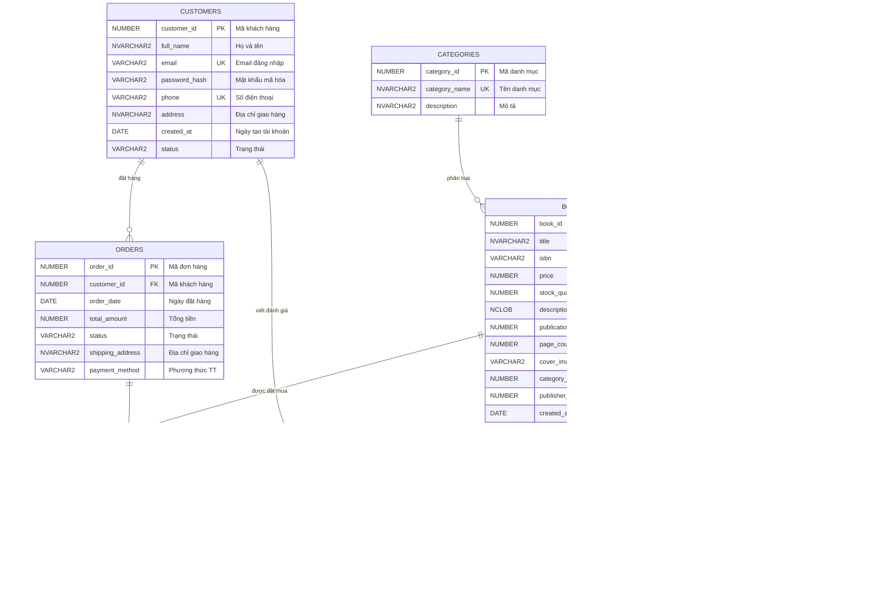

# 📐 BƯỚC 1: THIẾT KẾ CƠ SỞ DỮ LIỆU — DigiBook (Oracle 19c)

> **Chủ đề:** Thiết kế CSDL cho website bán sách DigiBook  
> **Nhóm 4:** Dũng, Nam, Hiếu, Phát  
> **DBMS:** Oracle 19c  
> **Chuẩn hóa:** 3NF (Third Normal Form)

---

## 📋 MỤC LỤC

1. [Tổng quan hệ thống](#1-tổng-quan-hệ-thống)
2. [Xác định các thực thể](#2-xác-định-các-thực-thể)
3. [Chi tiết thuộc tính, PK, FK và ràng buộc](#3-chi-tiết-thuộc-tính-pk-fk-và-ràng-buộc)
4. [Giải trình thiết kế (Design Rationale)](#4-giải-trình-thiết-kế-design-rationale)
5. [Chuẩn hóa 3NF](#5-chuẩn-hóa-3nf)
6. [Phân công công việc](#6-phân-công-công-việc)
7. [ERD — Entity Relationship Diagram (Mermaid)](#7-erd--entity-relationship-diagram-mermaid)

---

## 1. Tổng quan hệ thống

**DigiBook** là một nền tảng thương mại điện tử chuyên bán sách trực tuyến. Hệ thống cần hỗ trợ các chức năng chính sau:

| STT | Chức năng | Mô tả |
|-----|-----------|-------|
| 1 | Quản lý sách | Thêm, sửa, xóa, phân loại sách theo danh mục |
| 2 | Quản lý khách hàng | Đăng ký, đăng nhập, quản lý thông tin cá nhân |
| 3 | Đặt hàng | Tạo đơn hàng, thêm sách vào giỏ, thanh toán |
| 4 | Quản lý kho | Theo dõi số lượng tồn kho, nhập kho |
| 5 | Đánh giá sách | Khách hàng đánh giá & bình luận sách |
| 6 | Quản lý tác giả | Thông tin tác giả, liên kết tác giả - sách |
| 7 | Quản lý nhà xuất bản | Thông tin NXB, liên kết NXB - sách |

---

## 2. Xác định các thực thể

Hệ thống DigiBook bao gồm **9 thực thể chính** (vượt mức tối thiểu 6 theo yêu cầu):

| STT | Thực thể (Entity) | Ý nghĩa | Phụ trách |
|-----|--------------------|----------|-----------|
| 1 | `CUSTOMERS` | Khách hàng đăng ký trên hệ thống | **Dũng** |
| 2 | `CATEGORIES` | Danh mục/thể loại sách | **Dũng** |
| 3 | `AUTHORS` | Tác giả viết sách | **Nam** |
| 4 | `PUBLISHERS` | Nhà xuất bản | **Nam** |
| 5 | `BOOKS` | Thông tin sách (sản phẩm chính) | **Hiếu** |
| 6 | `BOOK_AUTHORS` | Bảng trung gian liên kết Sách — Tác giả (quan hệ N-N) | **Hiếu** |
| 7 | `ORDERS` | Đơn hàng của khách | **Phát** |
| 8 | `ORDER_DETAILS` | Chi tiết từng dòng sản phẩm trong đơn hàng | **Phát** |
| 9 | `REVIEWS` | Đánh giá & bình luận sách của khách hàng | **Phát** |

---

## 3. Chi tiết thuộc tính, PK, FK và ràng buộc

### 3.1. Bảng `CUSTOMERS` — Khách hàng *(Phụ trách: Dũng)*

| Thuộc tính | Kiểu dữ liệu | Ràng buộc | Mô tả |
|------------|---------------|-----------|-------|
| `customer_id` | `NUMBER` | **PK**, Auto-increment (Sequence + Trigger) | Mã khách hàng |
| `full_name` | `NVARCHAR2(100)` | `NOT NULL` | Họ và tên |
| `email` | `VARCHAR2(150)` | `NOT NULL`, `UNIQUE` | Email đăng nhập |
| `password_hash` | `VARCHAR2(256)` | `NOT NULL` | Mật khẩu đã mã hóa |
| `phone` | `VARCHAR2(15)` | `UNIQUE` | Số điện thoại |
| `address` | `NVARCHAR2(500)` | — | Địa chỉ giao hàng |
| `created_at` | `DATE` | `DEFAULT SYSDATE` | Ngày tạo tài khoản |
| `status` | `VARCHAR2(20)` | `DEFAULT 'ACTIVE'`, `CHECK IN ('ACTIVE', 'INACTIVE', 'BANNED')` | Trạng thái tài khoản |

### 3.2. Bảng `CATEGORIES` — Danh mục sách *(Phụ trách: Dũng)*

| Thuộc tính | Kiểu dữ liệu | Ràng buộc | Mô tả |
|------------|---------------|-----------|-------|
| `category_id` | `NUMBER` | **PK**, Auto-increment | Mã danh mục |
| `category_name` | `NVARCHAR2(100)` | `NOT NULL`, `UNIQUE` | Tên danh mục |
| `description` | `NVARCHAR2(500)` | — | Mô tả danh mục |

### 3.3. Bảng `AUTHORS` — Tác giả *(Phụ trách: Nam)*

| Thuộc tính | Kiểu dữ liệu | Ràng buộc | Mô tả |
|------------|---------------|-----------|-------|
| `author_id` | `NUMBER` | **PK**, Auto-increment | Mã tác giả |
| `author_name` | `NVARCHAR2(150)` | `NOT NULL` | Tên tác giả |
| `biography` | `NCLOB` | — | Tiểu sử tác giả |
| `birth_date` | `DATE` | — | Ngày sinh |
| `nationality` | `NVARCHAR2(50)` | — | Quốc tịch |

### 3.4. Bảng `PUBLISHERS` — Nhà xuất bản *(Phụ trách: Nam)*

| Thuộc tính | Kiểu dữ liệu | Ràng buộc | Mô tả |
|------------|---------------|-----------|-------|
| `publisher_id` | `NUMBER` | **PK**, Auto-increment | Mã NXB |
| `publisher_name` | `NVARCHAR2(200)` | `NOT NULL`, `UNIQUE` | Tên NXB |
| `address` | `NVARCHAR2(500)` | — | Địa chỉ NXB |
| `phone` | `VARCHAR2(15)` | — | Số điện thoại |
| `email` | `VARCHAR2(150)` | `UNIQUE` | Email liên hệ |

### 3.5. Bảng `BOOKS` — Sách *(Phụ trách: Hiếu)*

| Thuộc tính | Kiểu dữ liệu | Ràng buộc | Mô tả |
|------------|---------------|-----------|-------|
| `book_id` | `NUMBER` | **PK**, Auto-increment | Mã sách |
| `title` | `NVARCHAR2(300)` | `NOT NULL` | Tên sách |
| `isbn` | `VARCHAR2(20)` | `UNIQUE` | Mã ISBN |
| `price` | `NUMBER(10,2)` | `NOT NULL`, `CHECK (price > 0)` | Giá bán (VNĐ) |
| `stock_quantity` | `NUMBER` | `DEFAULT 0`, `CHECK (stock_quantity >= 0)` | Số lượng tồn kho |
| `description` | `NCLOB` | — | Mô tả sách |
| `publication_year` | `NUMBER(4)` | `CHECK (publication_year >= 1900 AND publication_year <= 2100)` | Năm xuất bản |
| `page_count` | `NUMBER` | `CHECK (page_count > 0)` | Số trang |
| `cover_image_url` | `VARCHAR2(500)` | — | Link ảnh bìa |
| `category_id` | `NUMBER` | **FK** → `CATEGORIES(category_id)` | Mã danh mục |
| `publisher_id` | `NUMBER` | **FK** → `PUBLISHERS(publisher_id)` | Mã NXB |
| `created_at` | `DATE` | `DEFAULT SYSDATE` | Ngày thêm vào hệ thống |

### 3.6. Bảng `BOOK_AUTHORS` — Liên kết Sách – Tác giả *(Phụ trách: Hiếu)*

| Thuộc tính | Kiểu dữ liệu | Ràng buộc | Mô tả |
|------------|---------------|-----------|-------|
| `book_id` | `NUMBER` | **PK** (composite), **FK** → `BOOKS(book_id)` | Mã sách |
| `author_id` | `NUMBER` | **PK** (composite), **FK** → `AUTHORS(author_id)` | Mã tác giả |

> **Ghi chú:** Đây là bảng trung gian giải quyết quan hệ **nhiều-nhiều** (N:N) giữa `BOOKS` và `AUTHORS`. Một cuốn sách có thể có nhiều tác giả, và một tác giả có thể viết nhiều cuốn sách.

### 3.7. Bảng `ORDERS` — Đơn hàng *(Phụ trách: Phát)*

| Thuộc tính | Kiểu dữ liệu | Ràng buộc | Mô tả |
|------------|---------------|-----------|-------|
| `order_id` | `NUMBER` | **PK**, Auto-increment | Mã đơn hàng |
| `customer_id` | `NUMBER` | **FK** → `CUSTOMERS(customer_id)`, `NOT NULL` | Mã khách hàng |
| `order_date` | `DATE` | `DEFAULT SYSDATE` | Ngày đặt hàng |
| `total_amount` | `NUMBER(12,2)` | `DEFAULT 0`, `CHECK (total_amount >= 0)` | Tổng tiền đơn hàng |
| `status` | `VARCHAR2(20)` | `DEFAULT 'PENDING'`, `CHECK IN ('PENDING', 'CONFIRMED', 'SHIPPING', 'DELIVERED', 'CANCELLED')` | Trạng thái đơn |
| `shipping_address` | `NVARCHAR2(500)` | `NOT NULL` | Địa chỉ giao hàng |
| `payment_method` | `VARCHAR2(30)` | `CHECK IN ('COD', 'CREDIT_CARD', 'BANK_TRANSFER', 'E_WALLET')` | Phương thức thanh toán |

### 3.8. Bảng `ORDER_DETAILS` — Chi tiết đơn hàng *(Phụ trách: Phát)*

| Thuộc tính | Kiểu dữ liệu | Ràng buộc | Mô tả |
|------------|---------------|-----------|-------|
| `order_detail_id` | `NUMBER` | **PK**, Auto-increment | Mã chi tiết |
| `order_id` | `NUMBER` | **FK** → `ORDERS(order_id)`, `NOT NULL` | Mã đơn hàng |
| `book_id` | `NUMBER` | **FK** → `BOOKS(book_id)`, `NOT NULL` | Mã sách |
| `quantity` | `NUMBER` | `NOT NULL`, `CHECK (quantity > 0)` | Số lượng mua |
| `unit_price` | `NUMBER(10,2)` | `NOT NULL`, `CHECK (unit_price > 0)` | Đơn giá tại thời điểm mua |
| `subtotal` | `NUMBER(12,2)` | `GENERATED ALWAYS AS (quantity * unit_price) VIRTUAL` | Thành tiền (cột ảo tính toán) |

> **Ghi chú:** `subtotal` là **virtual column** — một tính năng được hỗ trợ trên Oracle 19c, giúp tự động tính `quantity * unit_price` mà không cần lưu trữ vật lý.

### 3.9. Bảng `REVIEWS` — Đánh giá sách *(Phụ trách: Phát)*

| Thuộc tính | Kiểu dữ liệu | Ràng buộc | Mô tả |
|------------|---------------|-----------|-------|
| `review_id` | `NUMBER` | **PK**, Auto-increment | Mã đánh giá |
| `customer_id` | `NUMBER` | **FK** → `CUSTOMERS(customer_id)`, `NOT NULL` | Mã khách hàng |
| `book_id` | `NUMBER` | **FK** → `BOOKS(book_id)`, `NOT NULL` | Mã sách |
| `rating` | `NUMBER(1)` | `NOT NULL`, `CHECK (rating BETWEEN 1 AND 5)` | Số sao (1-5) |
| `comment` | `NCLOB` | — | Nội dung bình luận |
| `review_date` | `DATE` | `DEFAULT SYSDATE` | Ngày đánh giá |

> **Ràng buộc bổ sung:** Thêm `UNIQUE(customer_id, book_id)` để đảm bảo mỗi khách hàng chỉ được đánh giá **một lần** cho mỗi cuốn sách.

---

## 4. Giải trình thiết kế (Design Rationale)

### 4.1. Tại sao chọn 9 thực thể?

Hệ thống bán sách DigiBook là bài toán thương mại điện tử (e-commerce), do đó cần đáp ứng được các luồng nghiệp vụ quan trọng:

- **Luồng sản phẩm:** `CATEGORIES` → `BOOKS` → `BOOK_AUTHORS` → `AUTHORS` + `PUBLISHERS`. Sách được phân loại theo danh mục, liên kết với tác giả (N:N) thông qua bảng trung gian `BOOK_AUTHORS`, và mỗi sách thuộc một NXB duy nhất.
- **Luồng mua hàng:** `CUSTOMERS` → `ORDERS` → `ORDER_DETAILS` → `BOOKS`. Khách hàng tạo đơn hàng, mỗi đơn chứa nhiều chi tiết (nhiều sản phẩm).
- **Luồng tương tác:** `CUSTOMERS` → `REVIEWS` → `BOOKS`. Khách hàng có thể đánh giá sách đã mua.

### 4.2. Lựa chọn kiểu dữ liệu

| Quyết định | Lý do |
|------------|-------|
| Dùng `NVARCHAR2` / `NCLOB` cho dữ liệu text tiếng Việt | Hỗ trợ Unicode, đảm bảo hiển thị đúng ký tự tiếng Việt |
| Dùng `VARCHAR2` cho email, phone, ISBN | Dữ liệu ASCII thuần, tiết kiệm bộ nhớ |
| Dùng `NUMBER(10,2)` cho giá tiền | Đủ lưu trữ giá trị lên đến hàng tỷ VNĐ với 2 chữ số thập phân |
| Dùng `DATE` thay `TIMESTAMP` | Đủ cho bài toán đồ án, đơn giản hóa truy vấn |
| Dùng `NCLOB` cho mô tả, tiểu sử | Hỗ trợ nội dung text dài không giới hạn kích thước |

### 4.3. Quan hệ giữa các thực thể

| Quan hệ | Loại | Giải thích |
|---------|------|------------|
| `CUSTOMERS` → `ORDERS` | **1:N** | Một khách hàng có thể đặt nhiều đơn hàng |
| `ORDERS` → `ORDER_DETAILS` | **1:N** | Một đơn hàng chứa nhiều dòng chi tiết sản phẩm |
| `BOOKS` → `ORDER_DETAILS` | **1:N** | Một sách xuất hiện trong nhiều chi tiết đơn hàng |
| `CATEGORIES` → `BOOKS` | **1:N** | Một danh mục chứa nhiều sách |
| `PUBLISHERS` → `BOOKS` | **1:N** | Một NXB xuất bản nhiều sách |
| `BOOKS` ↔ `AUTHORS` | **N:N** | Giải quyết qua bảng trung gian `BOOK_AUTHORS` |
| `CUSTOMERS` → `REVIEWS` | **1:N** | Một khách hàng viết nhiều đánh giá |
| `BOOKS` → `REVIEWS` | **1:N** | Một sách nhận nhiều đánh giá |

### 4.4. Virtual Column cho `subtotal`

Trong bảng `ORDER_DETAILS`, cột `subtotal` được thiết kế dạng **virtual column** (`GENERATED ALWAYS AS (quantity * unit_price)`). Điều này đảm bảo:
- Giá trị luôn chính xác, không bị sai lệch do update thiếu.
- Không tốn dung lượng lưu trữ vật lý.
- Tương thích đầy đủ với Oracle 19c.

### 4.5. Lưu `unit_price` trong `ORDER_DETAILS`

Giá sách (`price`) trong bảng `BOOKS` có thể thay đổi theo thời gian (do khuyến mãi, điều chỉnh giá). Vì vậy, bảng `ORDER_DETAILS` cần lưu lại `unit_price` — giá tại thời điểm mua — để đảm bảo tính nhất quán dữ liệu lịch sử.

---

## 5. Chuẩn hóa 3NF

### 5.1. Chuẩn 1NF (First Normal Form) ✅
- Tất cả các cột đều chứa giá trị **nguyên tử** (atomic), không có cột nào chứa danh sách hay tập hợp dữ liệu.
- Mỗi bảng đều có **khóa chính** (Primary Key) xác định duy nhất từng bản ghi.
- Không có nhóm lặp (repeating groups) trong bất kỳ bảng nào.

### 5.2. Chuẩn 2NF (Second Normal Form) ✅
- Tất cả các thuộc tính không khóa đều **phụ thuộc hoàn toàn** vào toàn bộ khóa chính.
- Bảng `BOOK_AUTHORS` chỉ chứa khóa chính composite `(book_id, author_id)` — không có thuộc tính phụ thuộc bộ phận.
- Bảng `ORDER_DETAILS` có `order_detail_id` làm PK riêng, tránh phụ thuộc bộ phận nếu dùng composite key `(order_id, book_id)`.

### 5.3. Chuẩn 3NF (Third Normal Form) ✅
- Không tồn tại **phụ thuộc bắc cầu** (transitive dependency).
- Thông tin tác giả được tách riêng vào bảng `AUTHORS`, không lưu trong `BOOKS`.
- Thông tin NXB được tách riêng vào bảng `PUBLISHERS`, không lưu trong `BOOKS`.
- Thông tin danh mục được tách riêng vào bảng `CATEGORIES`, không lưu trong `BOOKS`.
- Thông tin khách hàng được tách riêng vào bảng `CUSTOMERS`, không lưu trong `ORDERS`.

> **Kết luận:** Toàn bộ thiết kế đã đạt chuẩn **3NF** — không có dữ liệu dư thừa, không có phụ thuộc bộ phận hay bắc cầu.

---

## 6. Phân công công việc

| Thành viên | Thực thể phụ trách | Ghi chú |
|------------|---------------------|---------|
| **Dũng** | `CUSTOMERS`, `CATEGORIES` | Quản lý khách hàng & phân loại sách |
| **Nam** | `AUTHORS`, `PUBLISHERS` | Quản lý tác giả & nhà xuất bản |
| **Hiếu** | `BOOKS`, `BOOK_AUTHORS` | Quản lý sách & liên kết tác giả |
| **Phát** | `ORDERS`, `ORDER_DETAILS`, `REVIEWS` | Quản lý đơn hàng & đánh giá |

---

### 7.1. Sơ đồ thực thể quan hệ (ERD)

### 7.2. Chú thích ký hiệu (Legend)

| Ký hiệu | Ý nghĩa | Mô tả |
|:---:|:---|:---|
| **PK** | **Primary Key** | Khóa chính, định danh duy nhất cho mỗi dòng trong bảng. |
| **UK** | **Unique Key** | Ràng buộc duy nhất, đảm bảo giá trị không bị trùng lặp (vd: email, phone). |
| **FK** | **Foreign Key** | Khóa ngoại, dùng để thiết lập mối quan hệ liên kết giữa các bảng. |
| **PK, FK** | **Composite Key** | Vừa là khóa chính (thành phần), vừa là khóa ngoại dẫn chiếu đến bảng khác. |
| **UK** (label) | *Label annotation* | Trong sơ đồ trên, `UK` được ghi chú cạnh tên thuộc tính để đánh dấu tính duy nhất. |
| `\|\|--o{` | Quan hệ 1 : n | Một bên có tối thiểu 1 và tối đa 1; bên kia có tối thiểu 0 và tối đa nhiều. |

---

## 📊 Tóm tắt thiết kế

| Chỉ số | Giá trị |
|--------|---------|
| Tổng số bảng | **9** |
| Tổng số quan hệ | **8** |
| Quan hệ 1:N | **7** |
| Quan hệ N:N (bảng trung gian) | **1** (`BOOK_AUTHORS`) |
| Chuẩn hóa | **3NF** ✅ |
| Virtual Column | **1** (`ORDER_DETAILS.subtotal`) |
| CHECK constraints | **8** |
| UNIQUE constraints | **6** |

---

