# 📐 BƯỚC 1: THIẾT KẾ CƠ SỞ DỮ LIỆU — DigiBook (Oracle 19c)

> **Dự án:** Hệ thống quản lý và bán sách DigiBook (Multi-Branch)
> **Nhóm thực hiện:** Dũng, Nam, Hiếu, Phát
> **DBMS:** Oracle 19c | **Chuẩn hóa:** 3NF

---

## 1. Kiến trúc tổng quan

Hệ thống được thiết kế theo mô hình **Đa chi nhánh (Multi-branch)**, tách biệt tài khoản hệ thống (`USERS`) và nhân sự (`STAFF`). Quy trình nghiệp vụ bao phủ từ quản lý kho, điều chuyển, bán hàng đến hậu mãi (Review, Wishlist).

## 2. Đặc tả chi tiết 25 thực thể (Entities)

### 2.1. Nhóm Hệ thống & Chi nhánh (Dũng phụ trách)

#### **1. BRANCHES (Chi nhánh)**

- `branch_id` (PK), `branch_code` (UK), `branch_name`, `branch_type`, `address`, `province`, `district`, `ward`, `phone`, `email`, `manager_id` (FK), `opening_date`, `status`, `is_main_branch`, `tax_code`, `latitude`, `longitude`, `created_at`, `updated_at`.

#### **2. ORDER_STATUSES (Trạng thái đơn)**

- `status_code` (PK), `status_name`, `status_name_vi`, `description`, `display_order`, `color_code`, `is_terminal`, `allowed_next_status`, `require_payment`, `is_active`.

#### **3. USERS (Tài khoản)**

- `user_id` (PK), `username` (UK), `email` (UK), `password_hash`, `full_name`, `role`, `phone`, `avatar_url`, `is_active`, `last_login_at`, `created_by` (FK), `created_at`, `updated_at`, `updated_by` (FK).

#### **4. STAFF (Nhân viên)**

- `staff_id` (PK), `user_id` (FK), `branch_id` (FK), `staff_code` (UK), `job_title`, `department`, `hire_date`, `resignation_date`, `base_salary`, `status`, `can_approve_order`, `can_manage_stock`, `created_at`, `updated_at`.

### 2.2. Nhóm Danh mục & Sản phẩm (Nam phụ trách)

#### **5. CATEGORIES (Danh mục)**

- `category_id` (PK), `category_name` (UK), `parent_id` (FK), `description`, `image_url`, `display_order`, `is_active`, `created_at`, `updated_at`.

#### **6. AUTHORS (Tác giả)**

- `author_id` (PK), `author_name`, `biography`, `birth_date`, `nationality`, `created_at`.

#### **7. PUBLISHERS (Nhà xuất bản)**

- `publisher_id` (PK), `publisher_name` (UK), `address`, `phone`, `email`, `website`.

#### **8. BOOKS (Sách)**

- `book_id` (PK), `isbn` (UK), `title`, `description` (CLOB), `category_id` (FK), `publisher_id` (FK), `price`, `stock_quantity`, `weight_gram`, `dimensions`, `page_count`, `publication_year`, `language`, `cover_type`, `is_featured`, `is_new_arrival`, `view_count`, `sold_count`, `is_active`, `created_by` (FK), `created_at`, `updated_at`, `updated_by` (FK).

#### **9. BOOK_IMAGES (Hình ảnh)**

- `image_id` (PK), `book_id` (FK), `image_url`, `is_main`, `sort_order`, `created_at`.

#### **10. BOOK_AUTHORS (Liên kết Tác giả)**

- `ba_id` (PK), `book_id` (FK), `author_id` (FK), `role`, `author_order`, `created_at`.

### 2.3. Nhóm Khách hàng & Bán hàng (Hiếu phụ trách)

#### **11. CUSTOMERS (Khách hàng)**

- `customer_id` (PK), `full_name`, `email` (UK), `phone`, `address`, `province`, `district`, `date_of_birth`, `gender`, `avatar_url`, `preferred_branch_id` (FK), `created_by` (FK), `created_at`, `updated_at`, `updated_by` (FK).

#### **12. SHIPPING_METHODS (Vận chuyển)**

- `method_id` (PK), `method_name`, `method_code` (UK), `carrier`, `base_fee`, `weight_fee_per_kg`, `free_threshold`, `estimated_days_min`, `estimated_days_max`, `is_active`, `display_order`, `created_at`, `updated_at`.

#### **13. CARTS (Giỏ hàng)**

- `cart_id` (PK), `customer_id` (FK), `branch_id` (FK), `session_id`, `status`, `converted_to_order_id` (FK), `created_at`, `updated_at`.

#### **14. CART_ITEMS (Chi tiết giỏ)**

- `cart_item_id` (PK), `cart_id` (FK), `book_id` (FK), `quantity`, `unit_price`, `added_at`, `updated_at`.

#### **15. ORDERS (Đơn hàng)**

- `order_id` (PK), `order_code` (UK), `customer_id` (FK), `branch_id` (FK), `status_code` (FK), `shipping_method_id` (FK), `coupon_id` (FK), `total_amount`, `discount_amount`, `shipping_fee`, `final_amount`, `order_date`, `ship_address`, `ship_province`, `ship_district`, `ship_ward`, `ship_phone`, `tracking_number`, `shipped_at`, `delivered_at`, `cancelled_at`, `customer_note`, `admin_note`, `created_by` (FK), `updated_at`, `updated_by` (FK), `cancelled_by` (FK), `cancellation_reason`.

#### **16. ORDER_DETAILS (Chi tiết đơn)**

- `detail_id` (PK), `order_id` (FK), `book_id` (FK), `quantity`, `unit_price`, `subtotal` (Virtual).

#### **17. ORDER_STATUS_HISTORY (Nhật ký đơn)**

- `history_id` (PK), `order_id` (FK), `old_status`, `new_status`, `changed_by` (FK), `changed_at`, `changed_from_ip`, `reason`.

### 2.4. Nhóm Kho vận & Nghiệp vụ khác (Phát phụ trách)

#### **18. BRANCH_INVENTORY (Tồn kho)**

- `inventory_id` (PK), `branch_id` (FK), `book_id` (FK), `quantity_available`, `quantity_reserved`, `quantity_transit_in`, `low_stock_threshold`, `reorder_point`, `warehouse_zone`, `shelf_code`, `bin_code`, `last_stock_in_at`, `last_stock_out_at`, `last_counted_at`, `created_at`, `updated_at`, `updated_by` (FK).

#### **19. INVENTORY_TRANSFERS (Điều chuyển)**

- `transfer_id` (PK), `transfer_code` (UK), `from_branch_id` (FK), `to_branch_id` (FK), `transfer_type`, `status`, `requested_by` (FK), `approved_by` (FK), `shipped_by` (FK), `received_by` (FK), `total_items`, `total_quantity`, `request_date`, `approved_date`, `shipped_date`, `received_date`, `shipping_fee`, `tracking_code`, `notes`, `created_at`, `updated_at`.

#### **20. TRANSFER_DETAILS (Chi tiết điều chuyển)**

- `detail_id` (PK), `transfer_id` (FK), `book_id` (FK), `quantity_requested`, `quantity_shipped`, `quantity_received`, `unit_cost`, `notes`, `created_at`, `updated_at`.

#### **21. INVENTORY_TRANSACTIONS (Giao dịch kho)**

- `txn_id` (PK), `branch_id` (FK), `book_id` (FK), `txn_type`, `reference_id`, `reference_type`, `reference_detail`, `quantity`, `unit_cost`, `total_cost`, `notes`, `created_by` (FK), `created_at`.

#### **22. COUPONS (Mã giảm giá)**

- `coupon_id` (PK), `coupon_code` (UK), `coupon_name`, `description`, `discount_type`, `discount_value`, `min_order_amount`, `max_discount_amount`, `usage_limit`, `usage_count`, `per_customer_limit`, `applicable_branches`, `start_date`, `end_date`, `is_active`, `created_by` (FK), `created_at`, `updated_at`, `updated_by` (FK).

#### **23. PAYMENT_TRANSACTIONS (Thanh toán)**

- `transaction_id` (PK), `order_id` (FK), `branch_id` (FK), `payment_method`, `amount`, `currency`, `status`, `transaction_code`, `gateway_name`, `gateway_request` (CLOB), `gateway_response` (CLOB), `error_message`, `paid_at`, `refunded_at`, `refund_amount`, `created_by` (FK), `created_at`, `updated_at`, `updated_by` (FK).

#### **24. REVIEWS (Đánh giá)**

- `review_id` (PK), `customer_id` (FK), `book_id` (FK), `order_id` (FK), `rating`, `comment_text`, `is_approved`, `approved_by` (FK), `approved_at`, `helpful_count`, `created_at`, `updated_at`.

#### **25. WISHLISTS (Yêu thích)**

- `wishlist_id` (PK), `customer_id` (FK), `book_id` (FK), `added_at`, `note`, `is_notified`, `notification_sent_at`.

---

## 3. Sơ đồ thực thể quan hệ chi tiết (Detailed ERD)

```mermaid
erDiagram
    BRANCHES {
        NUMBER branch_id PK
        VARCHAR2 branch_code UK
        NVARCHAR2 branch_name
        VARCHAR2 branch_type
        NVARCHAR2 address
        NVARCHAR2 province
        NVARCHAR2 district
        NVARCHAR2 ward
        VARCHAR2 phone
        VARCHAR2 email
        NUMBER manager_id FK
        DATE opening_date
        VARCHAR2 status
        NUMBER is_main_branch
        VARCHAR2 tax_code
        NUMBER latitude
        NUMBER longitude
        DATE created_at
        DATE updated_at
    }

    ORDER_STATUSES {
        VARCHAR2 status_code PK
        NVARCHAR2 status_name
        NVARCHAR2 status_name_vi
        NVARCHAR2 description
        NUMBER display_order
        VARCHAR2 color_code
        NUMBER is_terminal
        VARCHAR2 allowed_next_status
        NUMBER require_payment
        NUMBER is_active
    }

    USERS {
        NUMBER user_id PK
        VARCHAR2 username UK
        VARCHAR2 email UK
        VARCHAR2 password_hash
        NVARCHAR2 full_name
        VARCHAR2 role
        VARCHAR2 phone
        VARCHAR2 avatar_url
        NUMBER is_active
        DATE last_login_at
        NUMBER created_by FK
        DATE created_at
        DATE updated_at
        NUMBER updated_by FK
    }

    STAFF {
        NUMBER staff_id PK
        NUMBER user_id FK
        NUMBER branch_id FK
        VARCHAR2 staff_code UK
        NVARCHAR2 job_title
        VARCHAR2 department
        DATE hire_date
        DATE resignation_date
        NUMBER base_salary
        VARCHAR2 status
        NUMBER can_approve_order
        NUMBER can_manage_stock
        DATE created_at
        DATE updated_at
    }

    CATEGORIES {
        NUMBER category_id PK
        NVARCHAR2 category_name UK
        NUMBER parent_id FK
        NVARCHAR2 description
        VARCHAR2 image_url
        NUMBER display_order
        NUMBER is_active
        DATE created_at
        DATE updated_at
    }

    AUTHORS {
        NUMBER author_id PK
        NVARCHAR2 author_name
        NCLOB biography
        DATE birth_date
        NVARCHAR2 nationality
        DATE created_at
    }

    PUBLISHERS {
        NUMBER publisher_id PK
        NVARCHAR2 publisher_name UK
        NVARCHAR2 address
        VARCHAR2 phone
        VARCHAR2 email UK
        VARCHAR2 website
    }

    BOOKS {
        NUMBER book_id PK
        VARCHAR2 isbn UK
        NVARCHAR2 title
        NCLOB description
        NUMBER category_id FK
        NUMBER publisher_id FK
        NUMBER price
        NUMBER stock_quantity
        NUMBER weight_gram
        VARCHAR2 dimensions
        NUMBER page_count
        NUMBER publication_year
        VARCHAR2 language
        VARCHAR2 cover_type
        NUMBER is_featured
        NUMBER is_new_arrival
        NUMBER view_count
        NUMBER sold_count
        NUMBER is_active
        NUMBER created_by FK
        DATE created_at
        DATE updated_at
        NUMBER updated_by FK
    }

    BOOK_IMAGES {
        NUMBER image_id PK
        NUMBER book_id FK
        VARCHAR2 image_url
        NUMBER is_main
        NUMBER sort_order
        DATE created_at
    }

    BOOK_AUTHORS {
        NUMBER ba_id PK
        NUMBER book_id FK
        NUMBER author_id FK
        VARCHAR2 role
        NUMBER author_order
        DATE created_at
    }

    CUSTOMERS {
        NUMBER customer_id PK
        NVARCHAR2 full_name
        VARCHAR2 email UK
        VARCHAR2 phone
        NVARCHAR2 address
        NVARCHAR2 province
        NVARCHAR2 district
        DATE date_of_birth
        VARCHAR2 gender
        VARCHAR2 avatar_url
        NUMBER preferred_branch_id FK
        NUMBER created_by FK
        DATE created_at
        DATE updated_at
        NUMBER updated_by FK
    }

    SHIPPING_METHODS {
        NUMBER method_id PK
        NVARCHAR2 method_name
        VARCHAR2 method_code UK
        NVARCHAR2 carrier
        NUMBER base_fee
        NUMBER weight_fee_per_kg
        NUMBER free_threshold
        NUMBER estimated_days_min
        NUMBER estimated_days_max
        NUMBER is_active
        NUMBER display_order
        DATE created_at
        DATE updated_at
    }

    CARTS {
        NUMBER cart_id PK
        NUMBER customer_id FK
        NUMBER branch_id FK
        VARCHAR2 session_id
        VARCHAR2 status
        NUMBER converted_to_order_id FK
        DATE created_at
        DATE updated_at
    }

    CART_ITEMS {
        NUMBER cart_item_id PK
        NUMBER cart_id FK
        NUMBER book_id FK
        NUMBER quantity
        NUMBER unit_price
        DATE added_at
        DATE updated_at
    }

    ORDERS {
        NUMBER order_id PK
        VARCHAR2 order_code UK
        NUMBER customer_id FK
        NUMBER branch_id FK
        VARCHAR2 status_code FK
        NUMBER shipping_method_id FK
        NUMBER coupon_id FK
        NUMBER total_amount
        NUMBER discount_amount
        NUMBER shipping_fee
        NUMBER final_amount
        DATE order_date
        NVARCHAR2 ship_address
        NVARCHAR2 ship_province
        NVARCHAR2 ship_district
        NVARCHAR2 ship_ward
        VARCHAR2 ship_phone
        VARCHAR2 tracking_number
        DATE shipped_at
        DATE delivered_at
        DATE cancelled_at
        NVARCHAR2 customer_note
        NVARCHAR2 admin_note
        NUMBER created_by FK
        DATE updated_at
        NUMBER updated_by FK
        NUMBER cancelled_by FK
        NVARCHAR2 cancellation_reason
    }

    ORDER_DETAILS {
        NUMBER detail_id PK
        NUMBER order_id FK
        NUMBER book_id FK
        NUMBER quantity
        NUMBER unit_price
        NUMBER subtotal
    }

    ORDER_STATUS_HISTORY {
        NUMBER history_id PK
        NUMBER order_id FK
        VARCHAR2 old_status
        VARCHAR2 new_status
        NUMBER changed_by FK
        DATE changed_at
        VARCHAR2 changed_from_ip
        NVARCHAR2 reason
    }

    BRANCH_INVENTORY {
        NUMBER inventory_id PK
        NUMBER branch_id FK
        NUMBER book_id FK
        NUMBER quantity_available
        NUMBER quantity_reserved
        NUMBER quantity_transit_in
        NUMBER low_stock_threshold
        NUMBER reorder_point
        VARCHAR2 warehouse_zone
        VARCHAR2 shelf_code
        VARCHAR2 bin_code
        DATE last_stock_in_at
        DATE last_stock_out_at
        DATE last_counted_at
        DATE created_at
        DATE updated_at
        NUMBER updated_by FK
    }

    INVENTORY_TRANSFERS {
        NUMBER transfer_id PK
        VARCHAR2 transfer_code UK
        NUMBER from_branch_id FK
        NUMBER to_branch_id FK
        VARCHAR2 transfer_type
        VARCHAR2 status
        NUMBER requested_by FK
        NUMBER approved_by FK
        NUMBER shipped_by FK
        NUMBER received_by FK
        NUMBER total_items
        NUMBER total_quantity
        DATE request_date
        DATE approved_date
        DATE shipped_date
        DATE received_date
        NUMBER shipping_fee
        VARCHAR2 tracking_code
        NVARCHAR2 notes
        DATE created_at
        DATE updated_at
    }

    TRANSFER_DETAILS {
        NUMBER detail_id PK
        NUMBER transfer_id FK
        NUMBER book_id FK
        NUMBER quantity_requested
        NUMBER quantity_shipped
        NUMBER quantity_received
        NUMBER unit_cost
        NVARCHAR2 notes
        DATE created_at
        DATE updated_at
    }

    INVENTORY_TRANSACTIONS {
        NUMBER txn_id PK
        NUMBER branch_id FK
        NUMBER book_id FK
        VARCHAR2 txn_type
        NUMBER reference_id
        VARCHAR2 reference_type
        VARCHAR2 reference_detail
        NUMBER quantity
        NUMBER unit_cost
        NUMBER total_cost
        NVARCHAR2 notes
        NUMBER created_by FK
        DATE created_at
    }

    COUPONS {
        NUMBER coupon_id PK
        VARCHAR2 coupon_code UK
        NVARCHAR2 coupon_name
        NVARCHAR2 description
        VARCHAR2 discount_type
        NUMBER discount_value
        NUMBER min_order_amount
        NUMBER max_discount_amount
        NUMBER usage_limit
        NUMBER usage_count
        NUMBER per_customer_limit
        VARCHAR2 applicable_branches
        DATE start_date
        DATE end_date
        NUMBER is_active
        NUMBER created_by FK
        DATE created_at
        DATE updated_at
        NUMBER updated_by FK
    }

    PAYMENT_TRANSACTIONS {
        NUMBER transaction_id PK
        NUMBER order_id FK
        NUMBER branch_id FK
        VARCHAR2 payment_method
        NUMBER amount
        VARCHAR2 currency
        VARCHAR2 status
        VARCHAR2 transaction_code
        VARCHAR2 gateway_name
        CLOB gateway_request
        CLOB gateway_response
        NVARCHAR2 error_message
        DATE paid_at
        DATE refunded_at
        NUMBER refund_amount
        NUMBER created_by FK
        DATE created_at
        DATE updated_at
        NUMBER updated_by FK
    }

    REVIEWS {
        NUMBER review_id PK
        NUMBER customer_id FK
        NUMBER book_id FK
        NUMBER order_id FK
        NUMBER rating
        NVARCHAR2 comment_text
        NUMBER is_approved
        NUMBER approved_by FK
        DATE approved_at
        NUMBER helpful_count
        DATE created_at
        DATE updated_at
    }

    WISHLISTS {
        NUMBER wishlist_id PK
        NUMBER customer_id FK
        NUMBER book_id FK
        DATE added_at
        NVARCHAR2 note
        NUMBER is_notified
        DATE notification_sent_at
    }

    %% === Mối quan hệ === %%
    BRANCHES ||--o{ STAFF : "quản lý"
    BRANCHES ||--o{ ORDERS : "nhận"
    BRANCHES ||--o{ BRANCH_INVENTORY : "tồn kho"
    BRANCHES ||--o{ INVENTORY_TRANSFERS : "từ/đến"
    BRANCHES ||--o{ PAYMENT_TRANSACTIONS : "thu tiền"
  
    USERS ||--|| STAFF : "định danh"
    USERS ||--o{ USERS : "audit"
  
    STAFF ||--o{ BOOKS : "audit"
    STAFF ||--o{ CUSTOMERS : "hỗ trợ"
    STAFF ||--o{ ORDERS : "xử lý"
    STAFF ||--o{ ORDER_STATUS_HISTORY : "chuyển trạng thái"
    STAFF ||--o{ INVENTORY_TRANSFERS : "duyệt/vận chuyển"
    STAFF ||--o{ INVENTORY_TRANSACTIONS : "thực hiện"
    STAFF ||--o{ COUPONS : "quản lý"
    STAFF ||--o{ PAYMENT_TRANSACTIONS : "kiểm soát"
    STAFF ||--o{ REVIEWS : "duyệt"
  
    CUSTOMERS ||--o{ CARTS : "sở hữu"
    CUSTOMERS ||--o{ ORDERS : "đặt hàng"
    CUSTOMERS ||--o{ REVIEWS : "viết"
    CUSTOMERS ||--o{ WISHLISTS : "yêu thích"
  
    CATEGORIES ||--o{ BOOKS : "phân loại"
    CATEGORIES ||--o{ CATEGORIES : "cha-con"
  
    BOOKS ||--o{ BOOK_IMAGES : "có ảnh"
    BOOKS ||--o{ BOOK_AUTHORS : "được viết"
    BOOKS ||--o{ BRANCH_INVENTORY : "tồn tại"
    BOOKS ||--o{ ORDER_DETAILS : "được bán"
    BOOKS ||--o{ TRANSFER_DETAILS : "điều chuyển"
    BOOKS ||--o{ INVENTORY_TRANSACTIONS : "giao dịch"
    BOOKS ||--o{ REVIEWS : "đánh giá"
    BOOKS ||--o{ WISHLISTS : "lưu"
  
    AUTHORS ||--o{ BOOK_AUTHORS : "viết"
    PUBLISHERS ||--o{ BOOKS : "xuất bản"
  
    CARTS ||--o{ CART_ITEMS : "chứa"
  
    ORDERS ||--o{ ORDER_DETAILS : "gồm"
    ORDERS ||--o{ ORDER_STATUS_HISTORY : "audit"
    ORDERS ||--o{ PAYMENT_TRANSACTIONS : "thanh toán"
    ORDERS ||--o{ REVIEWS : "cho phép"
  
    ORDER_STATUSES ||--o{ ORDERS : "định nghĩa"
    SHIPPING_METHODS ||--o{ ORDERS : "vận chuyển"
    COUPONS ||--o{ ORDERS : "khuyến mãi"
  
    INVENTORY_TRANSFERS ||--o{ TRANSFER_DETAILS : "chi tiết"
```

---

## 4. Đặc tả logic nghiệp vụ

1. **Auto-Increment**: 26 Sequences và 49 Triggers quản lý PK.
2. **Chuẩn hóa 3NF**: Phân tách rõ ràng giữa phân quyền (`USERS`) và vận hành (`STAFF`).
3. **Audit Trail toàn diện**: Mọi thay đổi quan trọng đều có `created_by`, `updated_by` hoặc bảng history (`ORDER_STATUS_HISTORY`).
4. **Vận hành kho**: Theo dõi lượng hàng đang về (`quantity_transit_in`) và vị trí vật lý (`shelf_code`, `bin_code`).
5. **Thanh toán**: Hỗ trợ log CLOB cho Gateway Request/Response để phục vụ đối soát và debug.
