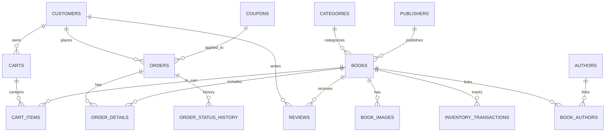
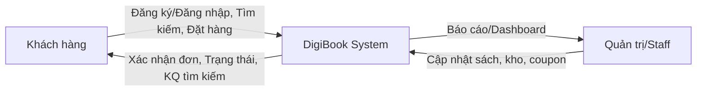
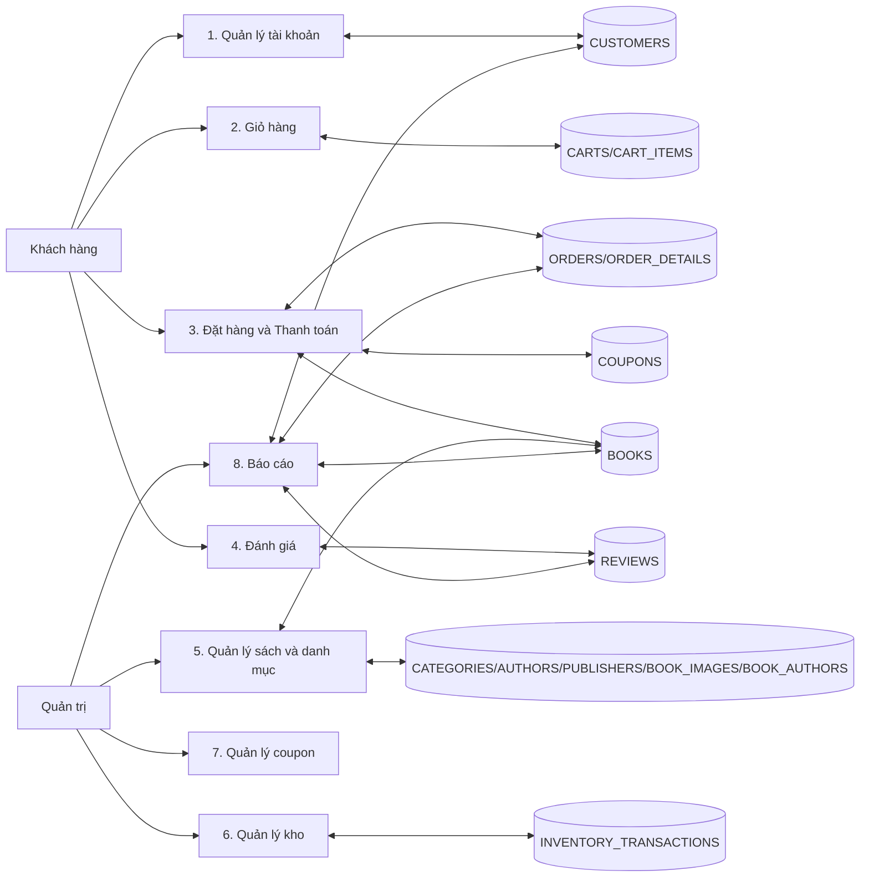

# CHƯƠNG 3: PHÂN TÍCH HỆ THỐNG

## 3.1. Phân tích chức năng

### 3.1.1. Mô hình phân cấp chức năng (BFD - Business Function Diagram)

```mermaid
graph TD
  A["Hệ thống DigiBook - Quản lý bán sách"] --> B1["Quản lý danh mục"]
  A --> B2["Quản lý sách"]
  A --> B3["Quản lý tác giả và NXB"]
  A --> B4["Quản lý khách hàng"]
  A --> B5["Giỏ hàng"]
  A --> B6["Đơn hàng và thanh toán"]
  A --> B7["Quản lý kho"]
  A --> B8["Khuyến mãi Coupon"]
  A --> B9["Đánh giá sách"]
  A --> B10["Báo cáo Dashboard"]

  B1 --> C11["Thêm danh mục"]
  B1 --> C12["Cập nhật danh mục"]
  B1 --> C13["Quản lý danh mục cha con"]

  B2 --> C21["Thêm sách"]
  B2 --> C22["Cập nhật thông tin sách"]
  B2 --> C23["Quản lý ảnh sách"]
  B2 --> C24["Gán tác giả cho sách"]

  B3 --> C31["Thêm tác giả"]
  B3 --> C32["Thêm NXB"]
  B3 --> C33["Tra cứu tác giả NXB"]

  B4 --> C41["Đăng ký khách hàng"]
  B4 --> C42["Cập nhật thông tin"]
  B4 --> C43["Quản lý trạng thái khách hàng"]

  B5 --> C51["Tạo giỏ hàng"]
  B5 --> C52["Thêm hoặc xóa sản phẩm"]
  B5 --> C53["Cập nhật số lượng"]

  B6 --> C61["Tạo đơn hàng"]
  B6 --> C62["Áp dụng coupon"]
  B6 --> C63["Cập nhật trạng thái đơn"]
  B6 --> C64["Theo dõi thanh toán"]

  B7 --> C71["Nhập kho"]
  B7 --> C72["Xuất kho theo đơn"]
  B7 --> C73["Điều chỉnh tồn"]

  B8 --> C81["Tạo coupon"]
  B8 --> C82["Kiểm tra điều kiện áp dụng"]
  B8 --> C83["Theo dõi lượt dùng"]

  B9 --> C91["Thêm đánh giá"]
  B9 --> C92["Kiểm tra đã mua"]

  B10 --> C101["Thống kê sách tồn kho"]
  B10 --> C102["Thống kê đơn hàng doanh thu"]
  B10 --> C103["Thống kê đánh giá"]
```

### 3.1.2. Mô tả chi tiết chức năng

**1) Quản lý danh mục**
- Mục đích: tổ chức cây phân loại sách để tìm kiếm và duyệt nhanh.
- Dữ liệu vào: CATEGORIES(category_id, category_name, parent_id, description).
- Dữ liệu ra: danh sách danh mục, cây phân cấp theo parent_id.
- Ràng buộc: category_name là duy nhất; parent_id có thể NULL.
- Nghiệp vụ: danh mục có thể nhiều cấp; xóa danh mục cần kiểm tra sách liên quan.

**2) Quản lý sách**
- Mục đích: lưu thông tin sách và hiển thị trên web UI.
- Dữ liệu vào: BOOKS, BOOK_IMAGES, BOOK_AUTHORS, CATEGORIES, PUBLISHERS.
- Dữ liệu ra: dữ liệu sách, ảnh chính, danh sách tác giả gắn kèm.
- Ràng buộc: price > 0, stock_quantity >= 0, ISBN duy nhất.
- Nghiệp vụ: một sách thuộc một danh mục, có nhiều ảnh và nhiều tác giả.

**3) Quản lý tác giả và NXB**
- Mục đích: quản lý nguồn gốc tác phẩm.
- Dữ liệu vào: AUTHORS, PUBLISHERS, BOOK_AUTHORS.
- Dữ liệu ra: hồ sơ tác giả/NXB, sách liên quan.
- Ràng buộc: publisher_name duy nhất; tác giả có thể nhiều vai trò.
- Nghiệp vụ: quan hệ N-N giữa sách và tác giả thông qua BOOK_AUTHORS.

**4) Quản lý khách hàng**
- Mục đích: lưu hồ sơ người mua và phục vụ đặt hàng.
- Dữ liệu vào: CUSTOMERS.
- Dữ liệu ra: danh sách khách hàng, trạng thái tài khoản.
- Ràng buộc: email duy nhất, status thuộc ACTIVE/INACTIVE/BANNED.
- Nghiệp vụ: chỉ khách hàng hợp lệ mới được tạo đơn và đánh giá.

**5) Giỏ hàng**
- Mục đích: lưu tạm các sách trước khi đặt mua.
- Dữ liệu vào: CARTS, CART_ITEMS, BOOKS.
- Dữ liệu ra: nội dung giỏ hàng theo khách.
- Ràng buộc: quantity > 0, unit_price > 0, cart_id hợp lệ.
- Nghiệp vụ: một khách có một giỏ đang ACTIVE; mỗi sách chỉ 1 dòng/giỏ.

**6) Đơn hàng và thanh toán**
- Mục đích: tạo đơn, tính tiền và theo dõi trạng thái.
- Dữ liệu vào: ORDERS, ORDER_DETAILS, CUSTOMERS, COUPONS.
- Dữ liệu ra: hóa đơn, tổng tiền, trạng thái thanh toán và giao hàng.
- Ràng buộc: mỗi đơn gắn với 1 khách hàng hợp lệ; status theo tập cho sẵn.
- Nghiệp vụ: không tạo đơn nếu tồn kho không đủ; UNIQUE(order_id, book_id).

**7) Quản lý kho**
- Mục đích: ghi nhận nhập/xuất/điều chỉnh tồn.
- Dữ liệu vào: INVENTORY_TRANSACTIONS, BOOKS, ORDERS.
- Dữ liệu ra: lịch sử giao dịch kho, tồn kho hiện tại.
- Ràng buộc: txn_type IN ('IN','OUT','ADJUST'), quantity > 0.
- Nghiệp vụ: xuất kho theo đơn bắt buộc có reference_id liên kết ORDERS.

**8) Khuyến mãi (Coupon)**
- Mục đích: áp dụng giảm giá cho đơn hàng.
- Dữ liệu vào: COUPONS, ORDERS.
- Dữ liệu ra: số tiền giảm, số lượt dùng.
- Ràng buộc: discount_type PERCENT/FIXED; thời gian hiệu lực hợp lệ.
- Nghiệp vụ: chỉ áp dụng nếu còn lượt dùng và đạt min_order_amount.

**9) Đánh giá sách**
- Mục đích: cho phép người đã mua phản hồi sách.
- Dữ liệu vào: REVIEWS, CUSTOMERS, BOOKS, ORDERS.
- Dữ liệu ra: điểm rating và nội dung đánh giá.
- Ràng buộc: mỗi khách chỉ đánh giá sách đã mua.
- Nghiệp vụ: rating trong ngưỡng cho phép; cập nhật thống kê điểm trung bình.

**10) Báo cáo/Dashboard**
- Mục đích: tổng hợp nhanh số liệu vận hành.
- Dữ liệu vào: BOOKS, ORDERS, CUSTOMERS, REVIEWS, INVENTORY_TRANSACTIONS.
- Dữ liệu ra: số sách, tồn kho, đơn hàng, doanh thu, điểm đánh giá.
- Nghiệp vụ: dữ liệu chỉ đọc; phục vụ giám sát nhanh.

## 3.2. Phân tích dữ liệu

### 3.2.1. Mô hình thực thể - kết hợp (ERD)

### 3.2.2. Sơ đồ luồng dữ liệu (DFD)

**a) Context Diagram**

**b) DFD Level 1**

