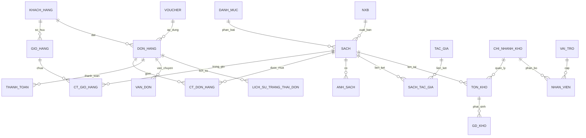
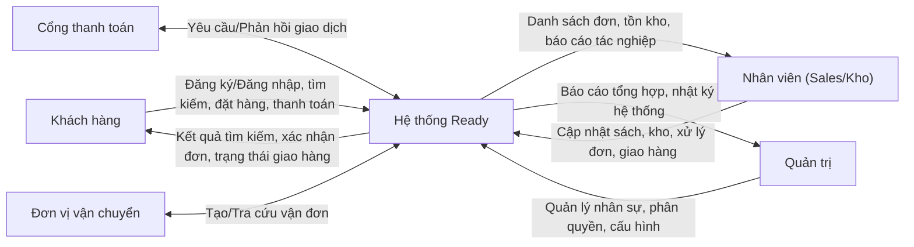
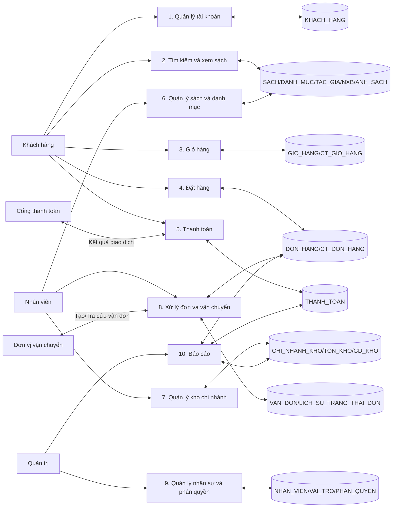

# CHƯƠNG 3: PHÂN TÍCH HỆ THỐNG

## 3.1. Phân tích chức năng

### 3.1.1. Mô hình phân cấp chức năng (BFD - Business Function Diagram)

```mermaid
graph TD
  A["Hệ thống Ready - Quản lý bán sách trực tuyến"] --> B1["Quản lý sản phẩm"]
  A --> B2["Quản lý khách hàng"]
  A --> B3["Giỏ hàng và đặt hàng"]
  A --> B4["Thanh toán trực tuyến"]
  A --> B5["Quản lý kho và chi nhánh"]
  A --> B6["Vận chuyển và trạng thái đơn"]
  A --> B7["Khuyến mãi và voucher"]
  A --> B8["Nhân viên và phân quyền"]
  A --> B9["Báo cáo và thống kê"]

  B1 --> C11["Thêm và cập nhật sách"]
  B1 --> C12["Quản lý danh mục"]
  B1 --> C13["Quản lý tác giả và NXB"]
  B1 --> C14["Quản lý ảnh sách"]

  B2 --> C21["Đăng ký và cập nhật hồ sơ"]
  B2 --> C22["Quản lý trạng thái khách hàng"]

  B3 --> C31["Tạo và cập nhật giỏ hàng"]
  B3 --> C32["Lập đơn hàng"]
  B3 --> C33["Theo dõi đơn hàng"]

  B4 --> C41["Tạo giao dịch thanh toán"]
  B4 --> C42["Xác nhận kết quả thanh toán"]

  B5 --> C51["Quản lý chi nhánh kho"]
  B5 --> C52["Nhập kho theo chi nhánh"]
  B5 --> C53["Xuất kho theo đơn"]
  B5 --> C54["Điều chỉnh tồn kho"]

  B6 --> C61["Tạo vận đơn"]
  B6 --> C62["Cập nhật trạng thái giao hàng"]
  B6 --> C63["Lưu lịch sử trạng thái"]

  B7 --> C71["Tạo và quản lý voucher"]
  B7 --> C72["Kiểm tra điều kiện áp dụng"]

  B8 --> C81["Quản lý nhân viên"]
  B8 --> C82["Phân quyền theo vai trò"]

  B9 --> C91["Thống kê doanh thu"]
  B9 --> C92["Thống kê tồn kho theo chi nhánh"]
  B9 --> C93["Báo cáo hiệu suất bán hàng"]
```

### 3.1.2. Mô tả chi tiết chức năng

**1) Quản lý sản phẩm**
- Mục đích: quản lý danh mục, sách và thông tin xuất bản phục vụ tra cứu và bán hàng.
- Dữ liệu vào: SACH, DANH_MUC, TAC_GIA, NXB, ANH_SACH, SACH_TAC_GIA.
- Dữ liệu ra: danh sách sách theo danh mục, chi tiết sách, ảnh đại diện, tác giả liên kết.
- Ràng buộc: giá bán > 0, ISBN duy nhất, mã danh mục hợp lệ.
- Ràng buộc: mỗi sách thuộc một danh mục; liên kết tác giả theo quan hệ N-N.
- Nghiệp vụ: mỗi sách chỉ có một ảnh chính; không xóa danh mục khi còn sách.

**2) Quản lý khách hàng**
- Mục đích: quản lý hồ sơ khách hàng và trạng thái tài khoản phục vụ đặt hàng.
- Dữ liệu vào: KHACH_HANG.
- Dữ liệu ra: hồ sơ khách hàng, trạng thái hoạt động, lịch sử cập nhật.
- Ràng buộc: email và số điện thoại duy nhất; trạng thái thuộc tập cho phép.
- Ràng buộc: mỗi đơn hàng bắt buộc gắn với một khách hàng hợp lệ.
- Nghiệp vụ: tài khoản bị khóa thì không tạo giỏ/đặt hàng mới.

**3) Giỏ hàng và đặt hàng**
- Mục đích: lưu tạm sản phẩm và chuyển giỏ thành đơn đặt hàng (OMS).
- Dữ liệu vào: GIO_HANG, CT_GIO_HANG, DON_HANG, CT_DON_HANG, SACH, TON_KHO.
- Dữ liệu ra: đơn hàng, chi tiết đơn, tổng tiền tạm tính.
- Ràng buộc: số lượng > 0; một sách chỉ một dòng trong giỏ.
- Ràng buộc: không tạo đơn nếu tồn kho = 0 hoặc vượt tồn hiện có.
- Nghiệp vụ: khi tạo đơn, chốt giá tại thời điểm đặt hàng.

**4) Thanh toán trực tuyến**
- Mục đích: ghi nhận giao dịch thanh toán online và đối soát kết quả.
- Dữ liệu vào: THANH_TOAN, DON_HANG, PHUONG_THUC_THANH_TOAN.
- Dữ liệu ra: trạng thái thanh toán, mã giao dịch, thời điểm thanh toán.
- Ràng buộc: mỗi đơn chỉ có một giao dịch thành công.
- Ràng buộc: đơn chỉ chuyển “Đã xác nhận” khi thanh toán thành công.
- Nghiệp vụ: giao dịch lỗi phải ghi nhận để đối soát/hoàn tiền.

**5) Quản lý kho và chi nhánh**
- Mục đích: theo dõi tồn kho theo chi nhánh và luồng nhập/xuất/điều chỉnh.
- Dữ liệu vào: CHI_NHANH_KHO, TON_KHO, GD_KHO, DON_HANG.
- Dữ liệu ra: tồn kho từng chi nhánh, nhật ký giao dịch kho.
- Ràng buộc: tồn kho không âm; giao dịch kho phải có loại và nguồn gốc rõ ràng.
- Ràng buộc: xuất kho phải liên kết đơn hàng hoặc phiếu điều chỉnh hợp lệ.
- Nghiệp vụ: ưu tiên xuất từ chi nhánh gần khách hoặc tồn cao.

**6) Vận chuyển và trạng thái giao hàng**
- Mục đích: quản lý vận đơn và lịch sử trạng thái giao hàng.
- Dữ liệu vào: VAN_DON, LICH_SU_TRANG_THAI_DON, DON_HANG.
- Dữ liệu ra: trạng thái giao hàng hiện tại và lịch sử cập nhật.
- Ràng buộc: trạng thái theo quy trình (Đã xác nhận → Đang giao → Đã giao).
- Ràng buộc: mỗi đơn chỉ có một vận đơn hiệu lực tại một thời điểm.
- Nghiệp vụ: cập nhật trạng thái bởi nhân viên hoặc hệ thống vận chuyển.

**7) Khuyến mãi và voucher**
- Mục đích: quản lý chương trình giảm giá và áp dụng cho đơn hàng.
- Dữ liệu vào: VOUCHER, DON_HANG, KHACH_HANG.
- Dữ liệu ra: số tiền giảm, lượt sử dụng, log áp dụng.
- Ràng buộc: voucher còn hiệu lực, chưa vượt giới hạn lượt dùng.
- Ràng buộc: mỗi khách có giới hạn sử dụng theo quy định.
- Nghiệp vụ: chỉ áp dụng khi đơn đạt mức tối thiểu và đúng loại giảm giá.

**8) Nhân viên và phân quyền**
- Mục đích: quản lý nhân sự nội bộ và kiểm soát quyền truy cập hệ thống.
- Dữ liệu vào: NHAN_VIEN, VAI_TRO, PHAN_QUYEN.
- Dữ liệu ra: danh sách nhân viên, vai trò, lịch sử phân quyền.
- Ràng buộc: mỗi nhân viên thuộc đúng một vai trò chính.
- Ràng buộc: quyền sửa đơn/kho chỉ cấp cho vai trò được phép.
- Nghiệp vụ: thay đổi vai trò phải được ghi nhận để audit.

**9) Báo cáo và thống kê**
- Mục đích: cung cấp báo cáo điều hành cho ban giám đốc và quản lý.
- Dữ liệu vào: DON_HANG, THANH_TOAN, TON_KHO, CHI_NHANH_KHO, NHAN_VIEN.
- Dữ liệu ra: báo cáo doanh thu, tồn kho, hiệu suất bán theo chi nhánh.
- Ràng buộc: dữ liệu chỉ đọc, không cho sửa trực tiếp từ báo cáo.
- Nghiệp vụ: tổng hợp theo ngày/tháng/quý, hỗ trợ so sánh kỳ trước.

## 3.2. Phân tích dữ liệu

### 3.2.1. Mô hình thực thể - kết hợp (ERD)

### 3.2.2. Sơ đồ luồng dữ liệu (DFD)

**a) Context Diagram**

**b) DFD Level 1**

